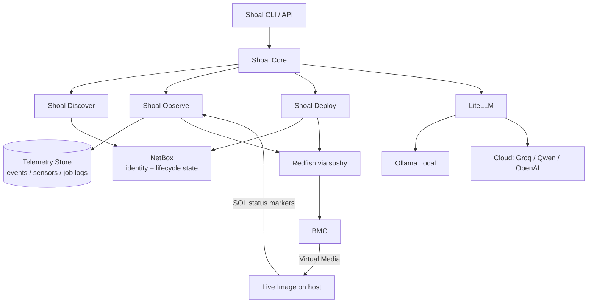

# Shoal: Comprehensive Design Document & Phased Implementation Plan

**Version:** 1.1  
**Date:** June 2026  
**Status:** Ready for Implementation  
**Intended Audience:** Human architect + Team of AI coding agents

**Purpose of this document**  
This is a self-contained, implementation-ready design and plan. It is written to be directly consumable by AI coding agents (Claude, Cursor, Devin-style agents, etc.). It contains:

- Clear principles and constraints  
- Modular architecture with well-defined interfaces  
- Data models and API contracts  
- Technology decisions with rationale  
- Detailed phased plan with acceptance criteria  
- Prompt engineering and RAG guidelines  
- Testing, security, and operational requirements  
- Instructions on how agents should use this document

**Changes in v1.1** (review + operator decisions folded in):
- **Feedback channel:** Serial-over-LAN (SOL) is now the **primary** host→Shoal status channel via a structured marker protocol. Console OCR is demoted to a diagnostic for graphics-only failure screens.
- **Normalization:** **hybrid** pipeline — deterministic parse first, AI reconciliation only for vendor spec-deviations, plus a learning loop.
- **Redfish client:** standardize on **`sushy` (Python)**; `gofish` (Go) removed.
- **Security:** secrets are **never sent to a cloud LLM**; identity and credentials are split; HTTPS-everywhere dropped for MVP (plain HTTP artifact serving on the management segment).
- **Reliability:** explicit **provisioning state machine + `ProvisioningJob`**, idempotent Deploy steps, mandatory cleanup, BMC session management.
- **Data:** NetBox holds **identity + lifecycle state only**; telemetry/events go to a dedicated store.
- **Plan:** added **Phase 0 (Lab)** prerequisite and **Phase 2 (Thesis Spike)** to de-risk the core bet early; single-process MVP topology.

---

## 1. Executive Summary & Vision

**Shoal** is a modern, BMC-centric bare-metal lifecycle platform focused on **Redfish/Swordfish** ecosystems.

**Core Differentiator**: The entire **provisioning path runs over the BMC management network only** — no provisioning VLAN, no PXE, no extra transit network. Status flows back over **Serial-over-LAN (SOL)**, and provisioning uses **Redfish Virtual Media + one custom live image** whose payload is embedded (written to local disk). Strong multimodal observability (SEL + sensors + SOL, with OCR for graphics-only failure screens).

**Target Users**: Bare-metal operators, colo/AI cluster teams, and organizations that value isolation and simplicity.

**Key Outcomes (MVP)**:
- Ingest messy hardware data → clean NetBox records (deterministic-first, AI for the messy edges)
- Real-time provisioning visibility via **SOL status markers** (SEL + sensors for health)
- Provision bare metal using only Redfish Virtual Media + one custom live image
- Dead-simple switch between local Ollama and cloud AI providers

**Success Metric for v1**: A solo developer or small team can stand up a working end-to-end demo in < 2 weeks using the lab environment described below.

**Scope note on the thesis**: "BMC-only" refers to the **provisioning path**. After install, the node reboots into its final OS and uses its normal production network. The provisioning loop needs no host data network because (a) the OS payload is embedded in the live image and written locally, and (b) status returns over SOL.

---

## 2. Goals, Non-Goals, Constraints & Principles

### 2.1 Goals
- Fast iteration for a solo developer or small team
- Excellent observability during provisioning
- Minimal infrastructure footprint
- Easy binary / container distribution
- Clean separation of concerns (so AI agents can work in parallel)

### 2.2 Non-Goals (MVP scope)
- Multi-tenancy, RBAC, enterprise features
- Full replacement of Ironic / MAAS / Foreman
- Support for every obscure vendor quirk
- High-scale orchestration (thousands of nodes)
- TLS everywhere / full PKI (deferred — see Section 11)

### 2.3 Constraints
- Must work well on modest hardware. **Reference GPU reality:** a Quadro P600 has only **2 GB VRAM** — the recommended local text models barely fit and `*-vision:11b` does **not** fit. Treat local vision as a slow CPU fallback; prefer cloud for vision. The hybrid normalizer (Section 4.2) is designed so most inputs never need a heavy model.
- Must support both fully local (air-gapped) and cloud-assisted AI
- Must be Python-based for rapid iteration
- Must produce single-binary or small-container deliverables where practical

### 2.4 Guiding Principles (for all agents)
1. **Modularity first** — Every major component must be independently testable and replaceable.
2. **AI abstraction** — All LLM calls go through a thin, swappable layer (LiteLLM recommended).
3. **Deterministic-first** — Use AI where the world is messy, not where data is already structured.
4. **Observability by default** — Every important action produces structured events.
5. **Human-in-the-loop friendly** — Prompts and outputs should be inspectable and debuggable.
6. **Secrets stay local** — Credentials are never placed in models that get logged or sent to an LLM.
7. **Simplicity over cleverness** — Prefer boring, readable code over complex abstractions. MVP runs as a single process.
8. **Document decisions** — Any significant choice must be recorded in this document or linked issues.

---

## 3. High-Level Architecture

### 3.1 Component Diagram (Text/Mermaid)



**MVP topology**: the four components are Python packages behind clean interfaces, run inside **one FastAPI process** with async background tasks. Promote any package to a separate service only when a real bottleneck demands it.

**Component Responsibilities** (strict boundaries):

| Component       | Owns                                                                 | Does NOT own                          |
|-----------------|----------------------------------------------------------------------|---------------------------------------|
| **Shoal Core**  | All AI logic, prompts, hybrid normalization, RAG, profile generation | Direct Redfish calls, NetBox writes  |
| **Shoal Discover** | Ingestion workflows, deterministic parsers/adapters, photo handling, NetBox writes | AI model calls (delegates to Core)   |
| **Shoal Observe**  | SEL/sensor polling, **SOL session + marker parsing**, telemetry writes, status aggregation, OCR of failure screens | AI model calls (delegates to Core)   |
| **Shoal Deploy**   | ISO building/serving, Redfish Virtual Media orchestration, **job state machine + cleanup** | AI model calls (delegates to Core)   |

---

## 4. Detailed Component Designs

### 4.1 Shoal Core (The AI Brain)

**Technology**:
- Python package `shoal_core`
- Uses **LiteLLM** as the single abstraction for all providers
- Pydantic models for all inputs/outputs (structured output enforced)

**Key Interfaces** (to be implemented as functions/classes):

```python
# shoal_core/interfaces.py
from shoal_common.models import (
    NormalizedAsset, NormalizationResult, NormalizedEvent,
)

async def normalize_asset(raw_data: dict | bytes) -> NormalizationResult:
    """Hybrid normalization. Deterministic parse first; AI reconciliation only
    when the deterministic result is incomplete/ambiguous/spec-deviant.
    Secrets are stripped from raw_data BEFORE any LLM call."""

async def normalize_event(raw_event: dict) -> NormalizedEvent:
    """Normalize SEL / sensor / SOL output."""

async def generate_provisioning_profile(asset: NormalizedAsset, requirements: dict) -> dict:
    """Recommend ISO config / post-install steps. Output is schema-validated;
    destructive actions require human approval before Deploy executes them."""
```

**Prompt Strategy**:
- All prompts live in `shoal_core/prompts/` as versioned `.md` or `.txt` files
- Use few-shot examples stored in a simple JSONL or vector store (Chroma / FAISS for MVP)
- Every prompt must include:
  - Clear task description
  - Output schema (JSON)
  - Examples
  - "Think step by step" + "Only output valid JSON"
  - "If uncertain, return a confidence score and the raw excerpt as evidence"

**RAG for Normalization**:
- Simple retrieval of previous successful normalizations + vendor-specific rules
- Start with file-based few-shot; evolve to vector DB only if needed

### 4.2 Shoal Discover (Hybrid Normalization)

**Why hybrid**: Vendor Redfish implementations deviate from spec and vary even within a single vendor/firmware. Pure deterministic parsing breaks on those deviations; pure-AI parsing pays nondeterminism, latency, and cost on the easy 90%. Shoal does both.

**Pipeline**:
1. **Deterministic fast path.** Per-vendor/model adapters + field extractors parse structured inputs (Redfish JSON, CSV) into `NormalizedAsset`; validate against the Pydantic schema.
2. **Confidence gate.** Accept only if required fields are present and values pass sanity checks (serial/MAC/IP format, model in known set) and an adapter matched.
3. **AI reconciliation (fallback).** Triggered when the deterministic result is incomplete, fails validation, is ambiguous, or matches no known vendor shape. The model receives the **redacted** raw payload + the partial deterministic result + the target schema, and returns structured JSON **with per-field confidence and a raw excerpt as evidence**.
4. **Validation & conflict policy.** Pydantic-validate AI output; where AI-filled values conflict with deterministic ones, set `needs_review = true` rather than silently trusting AI.
5. **Vision path.** Photos go straight to AI (no deterministic equivalent), still schema-validated and confidence-scored (cloud-preferred per Section 2.3).
6. **Learning loop.** Confirmed reconciliations feed the few-shot/RAG store and, when a stable pattern emerges, graduate into new deterministic adapter rules — so today's AI fix becomes tomorrow's deterministic rule, lowering cost and nondeterminism over time.

**Responsibilities**:
- Accept photo (base64 or file), Redfish dump, or CSV
- Run the hybrid pipeline via `shoal_core.normalize_asset`
- Resolve/stash BMC credentials in the secret backend and store only a `credential_ref`
- Write **identity + lifecycle state** to NetBox (via `pynetbox` or httpx)
- Return the NetBox device ID, confidences, and any `needs_review` warnings

**Input Formats (MVP)**:
1. Photo upload (vision path)
2. JSON dump from Redfish `/redfish/v1/Systems/1` (deterministic-first)
3. Simple CSV row (deterministic-first)

### 4.3 Shoal Observe

**Responsibilities**:
- Background polling of SEL and sensors for registered devices → write to the telemetry store
- **Own the SOL session** during provisioning and parse status markers (primary progress channel; see protocol below)
- Call `shoal_core.normalize_event` on every new SEL/sensor signal
- Expose current status + historical events (API + simple UI)
- OCR of **graphics-only failure screens** (POST/BIOS errors, pre-boot hangs) for diagnosis only — not the progress loop
- "Watch mode" during active provisioning (higher-frequency polling + live SOL tail)

**SOL Status Marker Protocol** (emitted by the live image, parsed by Observe):

```
SHOAL|<schema_ver>|<seq>|<iso8601_utc>|<phase>|<percent>|<state>|<detail>
```

- `schema_ver`: protocol version (start at `1`)
- `seq`: strictly increasing integer per job (dedupe/reorder, detect gaps)
- `phase`: `BOOT | DISK_PREP | IMAGE_WRITE | POSTINSTALL | VERIFY | DONE | ERROR`
- `percent`: `0`–`100`, or `-` when unknown
- `state`: `OK | WARN | ERROR | HEARTBEAT`
- `detail`: free text — **never secrets**

Example:
```
SHOAL|1|41|2026-06-19T04:10:11Z|IMAGE_WRITE|65|OK|writing rootfs to /dev/nvme0n1
SHOAL|1|42|2026-06-19T04:10:21Z|IMAGE_WRITE|-|HEARTBEAT|
SHOAL|1|43|2026-06-19T04:11:02Z|DONE|100|OK|reboot pending
```

**Parser rules**: accept only lines matching `SHOAL|1|...`; ignore all other console noise; update the `ProvisioningJob` from each valid record; treat a heartbeat gap beyond the stall timeout (e.g., 90s) as `STALLED → FAILED`. **Observe owns the single SOL session** for a node during a job (SOL is single-consumer on most BMCs).

**Transport**: real hardware uses Redfish `SerialConsole` / IPMI SOL; the lab reads the libvirt guest serial console directly (Section 8), so the protocol/producer/consumer are testable without real hardware.

**BMC session management**: use Redfish session-token auth, reuse/close sessions, cap concurrency per BMC (≈1–2), and back off on 4xx/5xx/throttling (respect `Retry-After`). Watch mode raises frequency but never exceeds the per-BMC cap.

**Watch Mode Contract**:
- When `Shoal Deploy` starts provisioning a node, it registers a watch session
- Observe increases polling frequency, takes ownership of the SOL stream, and pushes real-time updates (polling or WebSocket)

### 4.4 Shoal Deploy

**Responsibilities**:
- Accept target device + desired profile (from NetBox or explicit)
- Optionally call `shoal_core.generate_provisioning_profile` (destructive steps require human approval)
- Build custom live ISO with the **OS payload embedded** (`dracut` + embedded cloud-init / scripts); the live image writes it to local disk and emits SOL markers
- Serve the ISO over **plain HTTP on the management segment** (see Section 11)
- Use Redfish via **`sushy`** to: insert Virtual Media, set one-time boot override to CD/USB, power on / reboot
- Drive the **provisioning state machine**; monitor progress via Observe (SOL)
- On success: eject media, clear the boot override, reboot into final OS, update NetBox

**Reliability contract** (required, not Phase-6 polish):
- **Idempotent steps** — each action first reads current BMC state (media inserted? override set?) and converges; safe to re-run
- **Per-step timeouts** — media insert, power-on, boot, each SOL phase, final reboot; SOL heartbeat gaps trip stall detection
- **Mandatory cleanup** — an always-run finalizer ejects Virtual Media and clears the one-time boot override on success, failure, **and** cancel (otherwise the next boot is bricked)
- **Cancel + reconcile** — a cancel path stops a job and runs cleanup; on startup, orphaned `PROVISIONING` jobs are reconciled (resume or fail+cleanup)

**ISO Building Strategy (MVP)**:
- Start with a **static base live ISO** + injected configuration (cloud-init, scripts) with the payload embedded
- Evolve to fully dynamic generation in a later phase

---

## 5. Data Models & Cross-Component Contracts

**Core Shared Models** (in `shoal_common/models.py`):

```python
from datetime import datetime
from enum import Enum
from pydantic import BaseModel

class NormalizedAsset(BaseModel):
    serial: str
    model: str
    vendor: str
    bmc_ip: str
    credential_ref: str          # opaque handle into the secret backend
    # BMC username/password are NEVER stored here and NEVER sent to an LLM

class FieldConfidence(BaseModel):
    field: str
    confidence: float            # 0.0–1.0
    source: str                  # "deterministic" | "ai"
    evidence: str | None = None  # raw excerpt supporting the value

class NormalizationResult(BaseModel):
    asset: NormalizedAsset
    confidences: list[FieldConfidence]
    needs_review: bool           # true on deterministic/AI conflict or low confidence

class NormalizedEvent(BaseModel):
    event_type: str
    severity: str
    component: str
    message: str
    timestamp: datetime
    raw: dict                    # original payload for debugging

class LifecycleState(str, Enum):
    DISCOVERED = "discovered"
    READY = "ready"
    PROVISIONING = "provisioning"
    PROVISIONED = "provisioned"
    FAILED = "failed"

class ProvisioningJob(BaseModel):
    id: str
    device_id: str
    profile_ref: str
    state: LifecycleState
    attempt: int = 0
    phase: str | None = None
    percent: int | None = None
    last_marker_seq: int = 0
    started_at: datetime | None = None
    updated_at: datetime | None = None
    error: str | None = None
    sol_session_id: str | None = None
```

Also defined: `ProvisioningProfile`, `DeviceStatus` (current observed state), `WatchSession`. All inter-component communication uses these Pydantic models (or JSON Schema equivalents).

**Provisioning state machine**:

| From | To | Trigger |
|------|----|---------|
| DISCOVERED | READY | Asset normalized + stored, credentials resolvable |
| READY | PROVISIONING | Job created: media inserted, one-time boot override set, power on |
| PROVISIONING | PROVISIONED | `DONE/OK` marker + post-checks pass + media ejected + override cleared |
| PROVISIONING | FAILED | `ERROR` marker, timeout, stall, or BMC error |
| FAILED / cancel | (CLEANUP) → READY | Eject media, clear override, reset power state |

**Identity vs. credentials**: `NormalizedAsset` carries only identity/access metadata + an opaque `credential_ref`. BMC credentials live in a **secret backend** (env/file vault for MVP) keyed by device/`bmc_ip`. Password-like fields are stripped from any payload **before** an LLM call.

**Telemetry store** (NetBox is **not** a telemetry store): a dedicated store holds streams — Postgres tables in the existing stack, or SQLite for an ultra-simple MVP:
- `events(id, device_id, ts, type, severity, component, message, raw_ref)`
- `sensor_readings(device_id, ts, sensor, value, unit)`
- `job_log(job_id, ts, line)`

**NetBox Integration**:
- NetBox is the source of truth for **device identity + current `lifecycle_state`** only
- Use a small set of custom fields/tags (e.g., `shoal_lifecycle_state`, `shoal_credential_ref`); do **not** write time-series/telemetry into NetBox

---

## 6. AI Layer & Prompt Engineering Guidelines (Critical for Agents)

**Golden Rules for all prompts**:
1. Always request structured JSON output with a Pydantic schema
2. Include 2–4 high-quality few-shot examples
3. Tell the model its role and constraints explicitly
4. Ask it to "think step by step" before the final answer
5. Always return per-field confidence + raw excerpt as evidence
6. **Redact secrets** from any payload before it reaches the model

**Recommended starting models** (mind the 2 GB-VRAM reference GPU — see Section 2.3):
- Text (local): `llama3.2:3b` (Q4_K_M) fits modest VRAM; `qwen2.5:7b` (Q4) needs a larger GPU
- Vision: **prefer a cloud provider**; local `*-vision:11b` will not fit a P600 and runs CPU-bound (slow). The hybrid pipeline keeps most inputs off the vision path entirely.

**LiteLLM Configuration** (centralized in `shoal_core/ai.py`):
```python
import os
import litellm

def get_llm_client():
    provider = os.getenv("SHOAL_AI_PROVIDER", "ollama")
    model = os.getenv("SHOAL_AI_MODEL", "llama3.2:3b")
    # ... configure base_url, api_key, etc.
```

---

## 7. Technology Stack & Library Choices (MVP)

| Layer              | Library / Tool                  | Why |
|--------------------|----------------------------------|-----|
| Web Framework      | FastAPI                         | Async, great docs, Pydantic native |
| CLI                | Typer                           | FastAPI-style, excellent UX |
| Redfish            | **`sushy` (Python)**            | Python-native; shares lineage with `sushy-tools` (lab parity). (`gofish` is Go and cannot be imported here.) |
| AI Abstraction     | LiteLLM                         | Best-in-class multi-provider support |
| Local LLM          | Ollama                          | Easiest local experience |
| Image Building     | `dracut` + `xorriso` (via subprocess) | Proven for live ISOs |
| NetBox Client      | `pynetbox` or httpx             | Simple and reliable |
| Telemetry Store    | Postgres (existing) or SQLite   | Time-series/events; keep them out of NetBox |
| Secret Backend     | env/file vault (MVP)            | Keep BMC creds out of models, logs, and LLMs |
| Background Tasks   | FastAPI BackgroundTasks / asyncio (MVP) | Celery/Redis only if a real bottleneck appears |
| Testing            | pytest + pytest-asyncio         | Standard |
| Containerization   | Docker + Docker Compose         | Reproducible labs |

**Decision Record**: We chose Python + FastAPI + LiteLLM because iteration speed and ecosystem richness outweigh Go's binary advantages for the initial development phase. The Redfish client is `sushy` (Python) — the earlier `gofish` reference was incompatible with a Python codebase.

---

## 8. Lab & Development Environment

**Recommended Local Setup**:
- One powerful laptop/desktop (32+ GB RAM ideal)
- `sushy-tools` + libvirt/KVM creating 3–5 virtual Redfish nodes
- Docker Compose running:
  - Shoal app (single FastAPI process for MVP)
  - NetBox + PostgreSQL + Redis
  - Lightweight **HTTP** server for ISOs (no TLS in lab — see Section 11)
  - Ollama (or cloud keys)
- **SOL test harness**: the libvirt guests expose a real serial console, so the SOL marker protocol (Section 4.3) can be exercised locally even though sushy-tools does not proxy Redfish `SerialConsole`.

**Quick Start Command Goals**:
```bash
git clone ...
cd shoal
make lab-up          # infra: sushy-tools + NetBox + HTTP ISO server + Ollama
make dev-up          # the Shoal app (single process)
make demo-provision  # end-to-end demo against virtual nodes
make lab-down        # tear the lab down
```

---

## 9. Phased Implementation Plan (Agent-Ready)

Each phase is designed so multiple AI agents can work in parallel on different modules. **Phase 0 (Lab Environment Setup) is a hard prerequisite** and must be completed and verified before any other phase begins. **Phase 2 (Thesis Spike)** deliberately proves the riskiest, most novel part of the design (BMC-only provisioning + SOL feedback) before broad build-out.

### Phase 0: Lab Environment Setup (Prerequisite) (1–2 days)

**Owner(s)**: Agent(s) / human working on infrastructure

**Rationale**: Every subsequent phase depends on a working lab. Discover needs real Redfish data, Observe needs SEL/sensor + serial sources, and Deploy needs Virtual Media targets — all provided by virtual Redfish nodes. See Section 8 for the recommended setup.

**Tasks**:
1. Provision the host: install libvirt/KVM, Docker, and Docker Compose; verify hardware virtualization is enabled
2. Stand up `sushy-tools` (libvirt backend) emulating 3–5 virtual Redfish/BMC nodes
3. Bring up the supporting stack via Docker Compose:
   - NetBox + PostgreSQL + Redis
   - Lightweight HTTP server for serving ISOs
   - Ollama (local) and/or configured cloud AI provider keys
4. Configure a dedicated, isolated lab network so virtual BMC endpoints are reachable from Shoal
5. Verify you can read each virtual node's **libvirt serial console** (the SOL test harness for Phase 2)
6. Seed NetBox with an API token and minimal bootstrap data (site, device role) for integration tests
7. Create `.env.example` documenting all required endpoints/credentials (BMC IPs, NetBox URL/token, AI provider)
8. Add `make lab-up` / `make lab-down` targets (or scripts) to start/stop the lab reproducibly
9. Write a connectivity smoke-test script that validates every dependency

**Acceptance Criteria**:
- A Redfish client (`sushy`) can reach each virtual node at `/redfish/v1/Systems/...` and read system info
- NetBox is reachable via API using the seeded token
- Ollama (or the chosen cloud provider) answers a trivial completion through the planned config
- The ISO HTTP server serves a test file reachable from a virtual node's network
- Each node's serial console is readable
- `make lab-up` brings the full lab up and the smoke-test passes end-to-end

### Phase 1: Foundation & Scaffolding (1–3 days)

**Owner(s)**: Agent(s) working on infrastructure

**Tasks**:
1. Initialize monorepo with `pyproject.toml`, `ruff`, `pytest`, `pre-commit`
2. Create package structure:
   ```
   shoal/
     core/
     discover/
     observe/
     deploy/
     common/
   ```
3. Implement `Shoal Core` skeleton with the LiteLLM wrapper and the Pydantic models from Section 5 (`NormalizedAsset`, `NormalizationResult`, `NormalizedEvent`, `ProvisioningJob`, `LifecycleState`)
4. Implement the secret-backend stub and `credential_ref` resolution (no secrets in models)
5. Create `AGENTS.md` (project conventions, commands, style guide)
6. Wire the single-process app to lab services via `.env`; add Shoal service definitions to the lab Docker Compose (from Phase 0)
7. Basic CLI entrypoint with Typer

**Acceptance Criteria**:
- `shoal --help` works
- `make test` passes on the empty project
- LiteLLM can call both Ollama and a cloud provider from one config
- A credential is resolvable via `credential_ref` and never appears in a serialized model or log

### Phase 2: Thesis Spike — BMC-only provisioning + SOL feedback (vertical slice)

**Goal**: Prove the core bet end-to-end on the thinnest possible path before investing in breadth.

**Tasks**:
- Minimal custom live image: writes an embedded payload to disk and emits SOL markers (Section 4.3) with heartbeats; kernel cmdline `console=ttyS0,115200n8`
- Deploy: via `sushy`, insert Virtual Media, set one-time boot override, power on; **always-run cleanup** (eject media + clear override)
- Observe: tail the serial stream (libvirt console in lab; Redfish/IPMI SOL on real hardware), parse markers, drive the `ProvisioningJob` state machine, write `job_log`
- Minimal state machine + telemetry `job_log`

**Acceptance Criteria**:
- A node boots the live image via Virtual Media and Shoal advances phase/percent to `DONE` **purely via SOL**, then ejects media and clears the override
- Killing the heartbeat trips stall detection → `FAILED` + cleanup
- Validated on **real hardware (≥1 vendor)** if available; otherwise validated on libvirt with the real-hardware SOL-transport gap explicitly documented

### Phase 3: Shoal Discover + Core (Hybrid normalization)

**Parallelizable sub-tasks**:
- Agent A: Deterministic adapters for Redfish/CSV + confidence gate
- Agent B: AI reconciliation fallback + schema/conflict policy + per-field confidence
- Agent C: Photo/vision path (cloud-preferred)
- Agent D: NetBox writes (identity + `lifecycle_state`) + secret-backend integration (`credential_ref`)
- Agent E: Few-shot/RAG store + learning loop

**Acceptance Criteria**:
- A clean Redfish dump uses the deterministic path; a **spec-deviant** dump triggers AI reconciliation and still yields a correct `NormalizedAsset`
- Conflicts between deterministic and AI values are flagged `needs_review`
- Photo of a server label → correct asset with confidences
- A redaction test proves no secret is ever sent to a cloud LLM

### Phase 4: Shoal Observe (Broaden)

**Tasks**:
- SEL + sensor polling with BMC session reuse, per-BMC concurrency caps, and backoff
- Event normalization → telemetry store; correlation to NetBox devices
- SOL session ownership + watch mode (higher frequency during jobs)
- Status API + CLI command `shoal observe status <device>`
- (Stretch) OCR of graphics-only POST/BIOS failure screens

**Acceptance Criteria**:
- Point at a sushy-tools node → live SEL/sensor events normalized into the telemetry store and correlated to NetBox
- During a job, Observe owns SOL and surfaces real-time progress
- Watch-mode frequency does not exhaust BMC sessions (no lockouts)

### Phase 5: Shoal Deploy (Harden to MVP provisioning)

**Tasks**:
- ISO building pipeline (static base + config injection; embedded payload)
- Full reliability contract: idempotent steps, per-step timeouts, mandatory cleanup, cancel, startup reconcile
- `generate_provisioning_profile` (schema-validated; human approval for destructive steps)
- NetBox `lifecycle_state` updates driven by the state machine

**Acceptance Criteria**:
- Trigger provisioning for a virtual node; it boots the custom live image via Virtual Media
- Observe shows progress via SOL; on success the node is marked provisioned and media/override are cleaned up
- An injected mid-flight failure results in `FAILED` + cleanup, and a restart reconciles the orphaned job

### Phase 6: Polish, Graphics-OCR, Dynamic ISO, Production Readiness

**Tasks**:
- Graphics-only OCR pipeline for failure screens
- On-the-fly ISO generation based on profile
- Better error handling, retries, logging, metrics; record/replay vendor corpus in CI
- Packaging (Docker images; PyInstaller optional)
- TLS hardening with a BMC-trusted CA (moved here from MVP)
- Comprehensive test suite + demo scripts

---

## 10. Testing Strategy

- **Unit tests**: Every public function in Core (especially the hybrid normalizer and conflict policy)
- **Integration tests**: Against sushy-tools lab nodes
- **End-to-end**: Full Discover → Observe → Deploy flow in CI (using the lab)
- **Prompt regression tests**: Golden inputs/outputs for normalization
- **SOL protocol tests**: Validate producer/consumer/marker parsing against the libvirt serial console in the lab
- **Record/replay corpus**: Capture real Redfish responses per vendor/model/firmware as fixtures to test adapters and AI reconciliation without hardware
- **Observability**: Every AI call logs prompt hash, model, tokens, latency, and output

**Lab fidelity caveat** — what the lab *can* and *cannot* prove:
- **Provable in-lab (sushy-tools + libvirt)**: orchestration, the state machine, NetBox writes, the Virtual Media happy path, and the **SOL marker protocol** (via libvirt serial)
- **Real-hardware-only**: Redfish/IPMI SOL transport, vendor Virtual Media quirks, graphics-screen OCR, and realistic SEL/sensor variety. The Phase 2 spike exists to exercise these early.

---

## 11. Security & Operational Considerations (MVP)

- **Secrets never reach a cloud LLM** — redact before any model call; store BMC creds in the secret backend keyed by device; keep them out of `NormalizedAsset`, logs, and telemetry
- Never log BMC passwords in plain text
- All AI calls should be auditable (log model + prompt version)
- Rate limiting / backoff on external AI providers **and** per-BMC Redfish sessions
- **No HTTPS-everywhere for MVP** — serve ISOs/artifacts over plain **HTTP on the management segment**. Many BMCs reject self-signed certs for Virtual Media, and the management network is the trust boundary. TLS (with a BMC-trusted CA) is a Phase-6 hardening item, not abandoned.
- **Blast radius**: Shoal holds fleet BMC credentials; treat the host and secret backend as high-value and keep credential access auditable.

---

## 12. How AI Agents Should Use This Document

1. **Always start** by reading the latest version of this file + `AGENTS.md`
2. Before writing code for a component, re-read its section in Chapter 4
3. When making architectural decisions, propose changes as updates to this document first
4. Use structured output (Pydantic) everywhere AI is involved, and **prefer deterministic code over AI for structured inputs**
5. Never place secrets in models that get logged or sent to an LLM
6. Write tests alongside implementation
7. Update this document with any new decisions or learnings

---

## 13. Risks & Mitigations

| Risk                              | Likelihood | Impact | Mitigation |
|-----------------------------------|------------|--------|----------|
| Virtual Media throughput on slow BMC links | Medium | Medium | Keep the live image lean; embed only what's needed; document expectations |
| Inconsistent / spec-deviant Redfish implementations | High | Medium | `sushy` adapters + **hybrid AI reconciliation** + record/replay corpus |
| BMC session limits / lockout under polling | High | Medium | Session reuse, per-BMC concurrency caps, backoff |
| SOL transport varies (Redfish `SerialConsole` vs IPMI SOL) | Medium | Medium | Abstract the transport; libvirt serial in lab; validate on real hardware in Phase 2 |
| Secrets leaking to a cloud LLM | Medium | High | Redact before LLM; identity/credential split; secret backend |
| Local vision model won't fit the reference GPU (2 GB VRAM) | High | Medium | Cloud vision; deterministic-first reduces reliance |
| sushy-tools fidelity gap (OCR / vendor vmedia / SEL) | High | Medium | Mark real-hardware-only validations; Phase 2 spike on real hardware |
| Vision model quality on poor photos | Medium | High | Strong few-shot + fallback to manual entry |
| Prompt drift / quality regression | Medium | High | Version prompts + golden test cases |
| Graphics OCR brittleness | Medium | Low | Demoted to failure-screen diagnosis only; not the progress loop |

---

## 14. Appendices (To Be Expanded by Agents)

- A. Recommended starting prompts (asset normalization, event normalization, profile generation)
- B. Sample `.env` and Docker Compose files
- C. NetBox custom field recommendations (`shoal_lifecycle_state`, `shoal_credential_ref`)
- D. `sushy` usage notes + per-vendor adapter guidance
- E. SOL status marker protocol — full spec, phase definitions, and parser reference
- F. `ProvisioningJob` state machine — transitions, timeouts, and cleanup contract
- G. Record/replay Redfish corpus — capture format and fixture layout

---

**This document is now ready to be handed off to a team of AI coding agents.**

Next action for the human: Create the repository, commit this file as `SHOAL_COMPREHENSIVE_DESIGN_AND_IMPLEMENTATION_PLAN.md`, create `AGENTS.md`, stand up the lab environment (Phase 0), run the Phase 2 thesis spike to de-risk the core bet, and proceed through the remaining phases.

Would you like me to also generate the companion `AGENTS.md` file and/or the initial project scaffolding commands right now?
