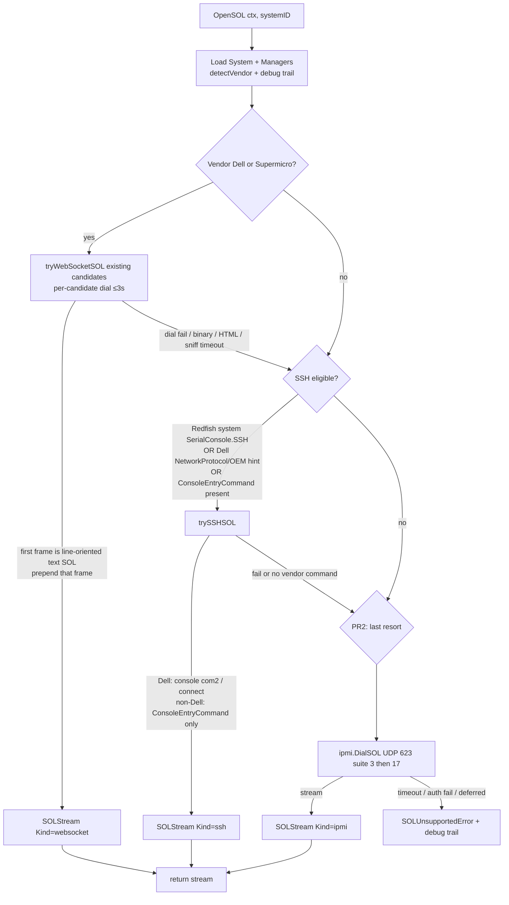

# Real-Hardware SOL Transports (Dell SSH Attach + Stdlib IPMI SOL)

**Author:** TBD  
**Date:** 2026-08-23  
**Status:** PR1 implemented (`feature/sol-transports` / live iDRAC attach). PR2 (stdlib IPMI SOL) not started. Rev 5.  
**Companion to:** `SHOAL_COMPREHENSIVE_DESIGN_AND_IMPLEMENTATION_PLAN.md` v2.0.9, `docs/real-hardware-sol-runbook.md`, `AGENTS.md` Golden Rule 6  
**Not a rewrite of those documents.** This records field findings from a live Dell iDRAC and the rule/interface changes needed so `BMC.OpenSOL` can actually attach on real hardware. Sections below that say “today” / “current implementation” describe the **pre-PR1** tree; see the runbook for what shipped.

**Rev 2 notes:** IPMI v2.0 byte-accurate tables (RAKP 1–4 unencrypted; Get Channel Auth Caps `[0x0E, 0x84]`; SIDc vs SIDm; Table 15-2 bits; HMAC fixture vectors); Dell-only SSH command guessing; WS sniff must not drop SOL or hang ahead of SSH; PR1 rule text does not claim an IPMI client that is not in the tree.

**Rev 3 notes:** Activate/Deactivate Payload are App NetFn `0x06` CMD `0x48`/`0x49` (Appendix G), not Transport `0x20`/`0x21` (SOL config). RAKP 1 has two reserved bytes after Role; ULen at offset 27. Role byte is `0x14` (Admin + name-only lookup); HMAC fixture recomputed.

**Rev 4 notes (operator decisions):** (1) No live attach, power-on, SSH, or IPMI against `172.16.21.202` until the operator says so — PR1/PR2 are fake-SSH / fake-RMCP only. (2) Cipher suite **17** (RAKP-HMAC-SHA256 + HMAC-SHA256-128 + AES-CBC-128) is **in PR2**: try suite 3 first, then 17 if Open Session rejects 3; no other shopping. Stdlib `crypto/sha256` only.

**Rev 5 notes:** Operator authorized live attach and `ForceRestart`. PR1 SSH path proven on iDRAC 7.30.10.50 (`Kind=ssh`, `console com2`, keyboard-interactive; WS `/console` is not SOL). Constraint (1) is lifted for this box; IPMI/UDP 623 still filtered. Field log: `docs/real-hardware-sol-runbook.md`.

---

## Overview

Shoal’s real-hardware serial transport (`SHOAL_SERIAL_TRANSPORT=redfish_sol` → `redfish.BMC.OpenSOL`) **could not** attach to a representative Dell 15G iDRAC before PR1. Redfish `SerialConsole` on that box is empty, the WebSocket candidates are not SOL (HTTP 200 / 404), and Golden Rule 6 previously forbade IPMI even as a SOL payload. The operator path that works on this iDRAC is SSH + `console com2` (BMC bridges IPMI SOL internally) — **implemented and live-proven in PR1**. SuperMicro-class BMCs typically have no SSH serial CLI at all and need IPMI 2.0 SOL on UDP/623 (PR2).

This design splits Golden Rule 6: **BMC control stays Redfish-only**; **SOL may leave HTTP** in a fixed order (line-oriented WS, then vendor SSH attach, then a stdlib-only IPMI 2.0 SOL client as last resort). No new Go modules. No `ipmitool`. Call sites still only see `BMC.OpenSOL`. Lab default remains `libvirt`.

---

## Background & Motivation

### Current implementation (v2.0.9 code)

`internal/common/redfish/sol.go` `client.OpenSOL` today:

1. Classify vendor via `detectVendor` (same helper as `screenshot.go`).
2. For Dell/Supermicro, dial unverified WS URLs from `solWSCandidates` (`/console`, `/wsman/virtualconsole`, `/kvms/0`, `/console/sol`) using already-allow-listed `github.com/coder/websocket`.
3. **Only if** `ComputerSystem.SerialConsole` (gofish type `HostSerialConsole`) `SSH.ServiceEnabled` is true, open SSH with `golang.org/x/crypto/ssh` (PTY, `ConsoleEntryCommand` or a bare shell). JSON property is `SerialConsole`.
4. Else `*SOLUnsupportedError`. `TestOpenSOL_IPMIOnly_Unsupported` encodes “IPMI-only BMC = unsupported” as a contract.

`internal/observe/sol/factory.go` `NewCombinedTransportFactory`: `redfish_sol` → `RedfishTransport` (calls `OpenSOL`); `libvirt`/`""` → existing virsh/PTY path; **`ipmi_sol` and anything else → `errorTransport`** (must never silently fall back). Opt-in is `SHOAL_SERIAL_TRANSPORT` or `StartJobRequest.serial_transport`. Default `libvirt` is unchanged.

### Why this fails on a real iDRAC (probe 2026-08-23)

Live box reachable from the operator workstation (passwords are **not** recorded here):

| Field | Value |
|-------|--------|
| BMC IP | `172.16.21.202` |
| Product | iDRAC, Dell PowerEdge R750, 15G Monolithic |
| Service tag | `C784MH3` |
| Hostname | `ai-summit-bcm-workshop-2-gpu01.nvidialaunchpad.com` |
| iDRAC FW | `7.30.10.50` |
| BIOS | `1.15.2` |
| PowerState at probe | **Off** |
| Redfish | `https://172.16.21.202/redfish/v1` (HTTP :80 302s to HTTPS) |
| TLS | Self-signed `CN=idrac-C784MH3` → `SHOAL_REDFISH_TLS_MODE=insecure` for first contact |
| Auth | HTTP basic, user `root` |
| Ports from this workstation | 443/80/22 **open**; **UDP/TCP 623 closed/filtered** |
| SSH banner | OpenSSH_9.9 |

Redfish facts that break today’s `OpenSOL`:

- Service root is public; Systems/Managers/Chassis are 401 without creds (auth with `root` succeeded).
- System: `/redfish/v1/Systems/System.Embedded.1`. Manager: `/redfish/v1/Managers/iDRAC.Embedded.1`.
- `Manager.SerialConsole`: `ServiceEnabled=false`, `ConnectTypesSupported=[]`.
- `System.SerialConsole` / `HostSerialConsole`: **absent/null**.
- `GraphicalConsole`: KVMIP enabled (max 6) — **not** a SOL progress channel (Golden Rule 5).
- `NetworkProtocol`: SSH enabled on 22; IPMI enabled in metadata; Telnet disabled; VirtualMedia enabled.
- BIOS already in Dell’s required SOL shape: `SerialComm=OnConRedir`, `SerialPortAddress=Com2`, `RedirAfterBoot=Enabled`.
- OEM attributes: `SerialRedirection.1.Enable=Enabled`, `IPMISOL.1.Enable=Enabled`, `SSH.1.Enable=Enabled`, user `root` (`Users.2`) `SolEnable=Enabled` and `IpmiLanPrivilege=Administrator`.
- `SerialInterfaces/Serial.1` OEM `SerialDataExport` / `SerialDataClear` is a **history dump**, not a live stream. Do not use it.

Dell’s documented operator SOL path (the BMC bridges IPMI SOL internally; the protocol we speak is SSH):

```
ssh root@<idrac>
console com2    # fallback: connect
```

`ipmitool sol activate` is the other documented path, but UDP 623 is filtered from this workstation. That is a data point: IPMI SOL must **timeout and fall through** with a debug trail, never hang the watch.

### Spec context (why Redfish does not give us a byte stream)

DMTF DSP0266 `ComputerSystem.SerialConsole` / `HostSerialConsole` / `Manager.SerialConsole` is a **directory of connect types** (SSH, Telnet, IPMI, Oem). There is no `GET /redfish/v1/.../sol` stream.

| Vendor | Typical host-serial path | Redfish SerialConsole metadata |
|--------|--------------------------|--------------------------------|
| Dell iDRAC | SSH then `console com2` / `connect`; IPMI SOL if UDP 623 open | Often empty (this firmware) |
| HPE iLO | SSH then `vsp` / `textcons`; also IPMI SOL | Sometimes advertised |
| Supermicro | IPMI SOL usual; some ATEN SMASH-CLP `start` on sol1 | Often IPMI-only |

IPMI 2.0 SOL is the lowest common denominator. It is **not** required to get *this* Dell box working (SSH attach is). It is required for SuperMicro-class BMCs.

### Additional field notes (out of scope for these PRs)

- Virtual Media: two independent slots (Manager `CD` + `RemovableDisk`; also System `VirtualMedia/1` and `/2`). Both empty, Insert/Eject present. Dual-media (`second_media`) is **provable on this box** (sushy cannot prove it). Recorded so it is not lost; not part of SOL work.
- SEL: `/redfish/v1/Managers/iDRAC.Embedded.1/LogServices/Sel` (5 entries); also Lclog, FaultList. Thermal: 4 temps; Chassis Sensors: 26 members. Observe poll already covers SEL/sensors via Redfish.
- Host was **Off**. **Decided (rev 4):** do not power on the host; do not attach SOL/SSH/IPMI against `172.16.21.202` until the operator says so. PR1/PR2 stay fake-SSH / fake-RMCP. Live attach is not a merge gate.

### Pain points

1. Golden Rule 6 + `TestOpenSOL_IPMIOnly_Unsupported` + factory `ipmi_sol` error together encode “never IPMI” more strictly than the comprehensive design’s older line 561 (“Redfish `SerialConsole` / IPMI SOL”).
2. SSH attach is gated on standard SerialConsole, which this iDRAC leaves empty even though SSH and serial redirection are enabled.
3. WS candidates are likely HTML5 KVM, not line-oriented SOL. Connecting them must not steal the progress channel.

---

## Goals & Non-Goals

### Goals

- Attach a line-oriented host-serial byte stream on this Dell iDRAC via SSH `console com2` / `connect` **when standard SerialConsole is empty**.
- Implement IPMI 2.0 SOL (RMCP / RMCP+ / RAKP / SOL payload type 1) **in-tree, stdlib only**, as last-resort backend of `OpenSOL` for IPMI-only BMCs, with **cipher suite 3 then suite 17**.
- Split Golden Rule 6 in `AGENTS.md`, the comprehensive design, and the runbook in the same change as the first code PR.
- Keep `SHOAL_SERIAL_TRANSPORT=redfish_sol` as the opt-in name; lab default `libvirt` unchanged.
- Preserve `[]CaptureDebugStep` + `sanitizePreview`; never log passwords/tokens.
- Unit-test with fake SSH and fake RMCP servers. **No live power-on, no live SOL/SSH/IPMI against `172.16.21.202` until the operator explicitly allows it.**

### Non-Goals

- New third-party modules (`github.com/bougou/go-ipmi`, VMware goipmi, expect libraries, extra SSH/WS libraries). **If a new module would be required, this design rejects the approach.**
- Exec of `ipmitool` / `ipmiutil` / `racadm`.
- IPMI for power, Virtual Media, boot override, SEL, sensors, inventory, or screenshots. Those stay Redfish.
- HTML5/KVM / GraphicalConsole as a progress channel (Golden Rule 5). OCR stays graphics-only failure screens.
- Expanding WS candidate URLs until a real vendor SOL URL is proven on hardware.
- Telnet SOL (still deferred).
- HPE `vsp`/`textcons` or ATEN SMASH-CLP in the first two PRs (vendor table is stubbed; not implemented).
- Power-on, Virtual Media insert, or live SOL/SSH/IPMI against the R750 (`172.16.21.202`) until the operator says so. PR1/PR2 are unit tests only.
- BIOS/attribute mutation (this box is already in the required SOL shape).
- SSH host-key pinning (existing documented limitation; unchanged).
- Cipher-suite shopping **beyond suites 3 and 17**, SOL keepalive tuning, IPMI 1.5 sessions, extra SOL encryption mode bits. Suite 17 is in PR2 (not deferred).

---

## Key Decisions

These are decided. Do not re-open them in implementation PRs.

1. **Split Golden Rule 6.** BMC control (power, Virtual Media, boot override, SEL, sensors, inventory, screenshots) stays Redfish-only via `internal/common/redfish`. SOL is the scoped exception: `OpenSOL` may leave HTTP. Wording lands in `AGENTS.md` + comprehensive design + runbook in PR1 (see below).
2. **Own stdlib IPMI SOL client, no third-party IPMI library.** No `go-ipmi`, no VMware goipmi, no `ipmitool` exec. Implementation uses `net`, `crypto/sha1`, `crypto/sha256`, `crypto/hmac`, `crypto/aes`, `crypto/cipher`, `crypto/rand`, `encoding/binary`, `io`, `context`, `time` only. `golang.org/x/crypto/ssh` and `github.com/coder/websocket` stay as already-allow-listed deps; do not add another SSH or WS library. If a new Go module would be required, reject the change.
3. **SSH attach is preferred when available**, including when standard SerialConsole is empty but `NetworkProtocol.SSH` and/or Dell OEM serial-redirection attributes say serial is on. This iDRAC is the SSH-first target. IPMI SOL is for SuperMicro-class / IPMI-only BMCs.
4. **Discovery order inside `OpenSOL` (fixed):**
   1. Line-oriented Redfish/OEM WebSocket, only if it is actually SOL (not HTML5 KVM). Existing candidate list; do not expand until a real URL is proven.
   2. SSH to the BMC + vendor attach command when SSH is enabled by Redfish SerialConsole **or** NetworkProtocol/OEM hints.
   3. IPMI 2.0 SOL (LAN plus) as **last resort** when no SSH serial path exists or SSH attach failed.
5. **IPMI is a last-resort SOL payload, not a second BMC API.** Call sites still only see `BMC.OpenSOL`. IPMI types do not leak into Deploy/Observe. `WatchSession.Transport` is **not** `ipmi_sol`; factory continues to error on that name (no silent IPMI, no silent libvirt fallback).
6. **Keep transport opt-in name `redfish_sol`.** Lab default `libvirt` unchanged. Renaming would churn `config`, `validate`, CLI, orchestrator, models, and the runbook for no operator benefit; IPMI is an internal backend, not a transport.
7. **SOL remains the primary provisioning progress channel** (Golden Rule 5). Do not use KVM/HTML5 or OCR in the progress loop.
8. **Host Off is a quiet stream, not an OpenSOL error — after a backend is chosen.** iDRAC SSH/IPMI will attach while PowerState=Off; Observe’s stall timer handles silence during a job. `OpenSOL` logs a debug step and returns success. **This does not apply to the WS probe:** a quiet WebSocket after dial is not proof of SOL (it is indistinguishable from idle KVM). WS must prove line-oriented text or fall through (see WS sniff).
9. **Two PRs (SSH first, IPMI second), with PR2 gated on byte-accurate spec + independent HMAC tests.** PR1 = Golden Rule 6 (WS/SSH only; IPMI specified as follow-on) + runbook field notes + Dell SSH attach. PR2 = stdlib IPMI SOL behind `OpenSOL`. Do not start PR2 until the IPMI section’s tables and §13.31-style HMAC fixture tests are in the tree. If review bandwidth is limited, split PR2 into **PR2a** (RMCP+ handshake + Activate Payload) and **PR2b** (SOL Read/Write/ACK-only keepalive). Each slice independently reviewable and revertible. No new modules in any PR.
10. **Package placement:** stdlib RMCP+/SOL client lives in `internal/common/redfish/internal/ipmi`. Go’s `internal/` rule makes it unimportable from Observe/Deploy/Core. Public surface is `DialSOL(ctx, Config) (io.ReadWriteCloser, error)` plus `Config`. No chassis/power/SEL commands in that package. `OpenSOL` is the only production caller.
11. **Cipher suites 3 then 17 only (operator, rev 4).** Try suite 3 first (interoperability default). If Open Session **rejects** suite 3, retry Open Session with suite 17. Do not shop 0/1/2/8/12/etc. RAKP auth failure is not a reason to try 17. UDP timeout on Get Channel Auth Caps is not a reason to try 17. If both Open Sessions are rejected → `SOLUnsupportedError` with debug. SHA256 via stdlib `crypto/sha256`.
12. **No live attach on this R750 until the operator says so (operator, rev 4).** Unit tests only. Do not power on the host. Do not SSH/IPMI/SOL against `172.16.21.202` from PR1/PR2.

---

## Proposed Design

### Golden Rule 6 — before / after

Land the **control-plane split** in **the same change as PR1 code**, in all three of: `AGENTS.md` §1 item 6 and §7 SOL ownership; comprehensive design §12.1 item 6 and the Redfish/SOL paragraphs that still say “never IPMI”; `docs/real-hardware-sol-runbook.md`.

**Do not claim an IPMI client that is not in the tree.** PR1 lands the split and names IPMI as specified follow-on. PR2 flips those sentences to present tense.

**Before (AGENTS.md §1):**

> 6. **Redfish only via `internal/common/redfish` (gofish-backed).** gofish is the chosen Redfish stack from day one. **gofish types must not leak** outside `internal/common/redfish`. Reuse sessions (or basic auth in lab), cap per-BMC concurrency (~1–2), and back off on throttling (respect `Retry-After`).

**After (PR1 — land this):**

> 6. **BMC control is Redfish-only via `internal/common/redfish` (gofish-backed).** gofish is the chosen Redfish stack from day one. **gofish types must not leak** outside `internal/common/redfish`. Reuse sessions (or basic auth in lab), cap per-BMC concurrency (~1–2), and back off on throttling (respect `Retry-After`). Power, Virtual Media, boot override, SEL, sensors, inventory, and screenshots **never** use IPMI (no `ipmitool chassis`, no IPMI media, no IPMI inventory).
>
>    **SOL is the scoped exception.** `BMC.OpenSOL` may leave HTTP, in this order: (1) line-oriented Redfish/OEM WebSocket if it is actually SOL (not HTML5 KVM); (2) SSH to the BMC + vendor attach command when SSH is enabled — including when standard `ComputerSystem.SerialConsole` (gofish `HostSerialConsole`) is empty but `NetworkProtocol` / Dell OEM serial-redirection attributes show serial is on. **IPMI 2.0 SOL as last resort is specified in the real-hardware SOL design; it is not implemented in this change.** Until that follow-on lands, an IPMI-only BMC still returns `*SOLUnsupportedError`. IPMI, when implemented, is a SOL payload, not a second BMC API. Call sites still only see `OpenSOL`.

**After (PR2 — replace the last paragraph of rule 6):**

>    **SOL is the scoped exception.** `BMC.OpenSOL` may leave HTTP, in this order: (1) line-oriented Redfish/OEM WebSocket if it is actually SOL (not HTML5 KVM); (2) SSH to the BMC + vendor attach command when SSH is enabled — including when standard `ComputerSystem.SerialConsole` (gofish `HostSerialConsole`) is empty but `NetworkProtocol` / Dell OEM serial-redirection attributes show serial is on; (3) IPMI 2.0 SOL (LAN plus, stdlib client in `internal/common/redfish/internal/ipmi`) as **last resort** when no SSH serial path exists. IPMI is a SOL payload, not a second BMC API. Call sites still only see `OpenSOL`. IPMI types must not leak into Deploy/Observe.

**AGENTS.md §7 SOL ownership (PR1):** replace “Redfish only — never raw IPMI, even for BMCs that only advertise IPMI SOL” with: control-plane Redfish-only; `OpenSOL` backends (1)(2) as above; **IPMI last-resort client not yet in tree** (IPMI-only BMC → `*SOLUnsupportedError` with debug trail; `WatchSession.Transport=ipmi_sol` remains an error). `redfish_sol` remains unit-tested only vs sushy (no SOL in the lab). PR2 deletes the “not yet in tree” clause.

**Comprehensive design v2.0.9 line 561** already said “real hardware uses Redfish `SerialConsole` / IPMI SOL”. Keep that sense; in PR1, rephrase later “never IPMI” contradictions to “never IPMI for BMC control; SOL IPMI client is a follow-on.” Update §7.1 `golang.org/x/crypto` row to: SSH attach for `OpenSOL` (Redfish-advertised **or** Dell NetworkProtocol/OEM-inferred); not a new module. Drop `ipmi_sol` as a `WatchSession` transport string. PR2 notes the stdlib IPMI SOL client in §7.1 without adding a module.

### Discovery flow



Every branch appends `CaptureDebugStep` (`Phase`: `detect` | `probe` | `request` | `parse`). Failures use `sanitizePreview`. Success still returns `stream.Debug` so operators can see *which* path won.

UDP/623 filtered (this workstation → this iDRAC): `DialSOL` must fail in **≤ ~6s** (3×2s retries on the first RMCP packet), record `udp 623 timeout`, and become `SOLUnsupportedError` only if SSH/WS also failed. Never block the watch on a black hole.

### Transport name and rollback

| Knob | Value | Effect |
|------|--------|--------|
| `SHOAL_SERIAL_TRANSPORT` unset / `libvirt` | lab default | Existing virsh/PTY path. **Rollback.** |
| `SHOAL_SERIAL_TRANSPORT=redfish_sol` | opt-in | Orchestrator sets `WatchSession.Transport=redfish_sol`, `Target=bmc_endpoint`. `RedfishTransport.Open` → `BMC.OpenSOL`. |
| `StartJobRequest.serial_transport` | per-job override | Same as today (`orchestrator.resolveSerialTransport`). |
| `WatchSession.Transport=ipmi_sol` | **still an error** | `factory.go` `errorTransport`. IPMI is not a transport. |

`config.Load` / `validate.StartJobRequest` continue to accept only `""` | `libvirt` | `redfish_sol`. Do not add `ipmi_sol` to the allow-list of transport names.

Rollback for a failed real-hardware job: `unset SHOAL_SERIAL_TRANSPORT` (or `libvirt`). SSH/IPMI failures surface as `*SOLUnsupportedError` (wrapped by `RedfishTransport.Open`); Orchestrator already maps transport failure to `HandleTerminal(ReasonTransport)`. No silent IPMI, no IPMI for power.

### Call-site boundary (unchanged)

```
cmd/shoal
  → observe/sol.RedfishTransport.Open
       → redfish.BMC.OpenSOL          // only BMC method that owns a long-lived stream
            → tryWebSocketSOL         // coder/websocket, already allow-listed
            → trySSHSOL               // x/crypto/ssh, already allow-listed
            → ipmi.DialSOL            // PR2; nested internal; stdlib
```

Observe still scans lines with `bufio.Scanner` (`redfish_transport.go`). Marker parsing unchanged. Deploy never imports `ipmi` or `observe`.

---

### Dell SSH attach (PR1)

**Problem:** `trySSHSOL` is gated on `sys.SerialConsole.SSH.ServiceEnabled`. This iDRAC has null SerialConsole, SSH on 22, and OEM serial redirection enabled.

**Eligibility (`sshEligible`) — vendor-guarded.** Widening SSH without narrowing attach commands would `Start("console com2")` on every BMC with management SSH (HPE/SMASH/generic). Today `trySSHSOL` is gated **only** on system `SSH.ServiceEnabled` (`sol.go` 85–92) and never guesses a command unless `ConsoleEntryCommand` is set. PR1 must keep that discipline for non-Dell.

Gofish field names (pinned `gofish@v0.20.0`):

| Redfish JSON | gofish type / field | Use |
|--------------|---------------------|-----|
| `ComputerSystem.SerialConsole.SSH.ServiceEnabled` / `Port` | `HostSerialConsole.SSH.ServiceEnabled` `Port` | Eligibility #1 (any vendor) |
| `Manager.SerialConsole.ServiceEnabled` + `ConnectTypesSupported` | `SerialConsole.ServiceEnabled bool` + `ConnectTypesSupported []SerialConnectTypesSupported` — **no nested SSH object** | Eligibility #2 only if `ServiceEnabled &&` slice contains `"SSH"`. Do **not** treat `ServiceEnabled` alone as SSH (IPMI-only managers have this true). |
| `Manager.NetworkProtocol.SSH` | `Manager.NetworkProtocol() (*NetworkProtocolSettings, error)` → `SSH.ProtocolEnabled` / `SSH.Port int64` | **Dell-only** eligibility #3. Missing/empty `@odata.id` or `NetworkProtocol()` error → “not enabled”, **not** `OpenSOL` failure. |
| Dell OEM `Attributes` | **not in gofish** — raw `api.Get` (same pattern as `screenshot.go`) | Dell-only eligibility #4. 404 = debug only. |

Any one of:

1. **Any vendor:** `sys.SerialConsole.SSH.ServiceEnabled` (today’s path; keep). JSON name `SerialConsole`, gofish type `HostSerialConsole`.
2. **Any vendor:** manager `SerialConsole.ServiceEnabled && ConnectTypesSupported` contains `"SSH"`.
3. **Dell only:** `NetworkProtocol().SSH.ProtocolEnabled == true`.
4. **Dell only:** OEM attribute `SerialRedirection.1.Enable` / `IPMISOL.1.Enable` / `SSH.1.Enable` is `Enabled`.

Non-Dell BMCs with only `NetworkProtocol.SSH` (almost all of them) are **not** SSH-eligible unless #1, #2, or a non-empty `ConsoleEntryCommand` applies. They fall through (PR1: unsupported; PR2: IPMI).

Attribute GETs (Dell-only, best-effort, record 404s in debug, do not fail OpenSOL if missing):

- `/redfish/v1/Managers/{id}/Oem/Dell/DellAttributes/iDRAC.Embedded.1`
- `/redfish/v1/Managers/{id}/Attributes`

Parse a flat `Attributes` map; look up those keys case-insensitively. Do not GET `SerialDataExport`.

**Port:** `SerialConsole.SSH.Port` if > 0, else (Dell) `NetworkProtocol.SSH.Port`, else 22. Host from `sshHost(cfg.BaseURL)` as today.

**Auth:** same `cfg.Username` / `cfg.Password` already passed into `OpenSOL` (secrets backend → `RedfishTransport`). Do not add a second credential. On this box `Users.2` has `SolEnable=Enabled`; SSH uses the same `root` user as Redfish basic.

**PTY / session (extend today’s `trySSHSOL`):** keep `RequestPty("vt100", 24, 80)`, password auth, `HostKeyCallback: ssh.InsecureIgnoreHostKey()` (documented limitation). **Add `StdinPipe` + drain stderr** so Close can send an escape and so iDRAC CLI chatter cannot deadlock the channel.

**Attach command order — vendor-guarded:**

1. If Redfish `ConsoleEntryCommand` is non-empty, `session.Start(cmd)` (today; any vendor).
2. Else **only if `vendor == VendorDell`:**

| Vendor | Primary | Fallback | Shell last-resort |
|--------|---------|----------|-------------------|
| Dell / iDRAC | `console com2` | `connect` | write those two lines |
| HPE (stub only; not PR1) | `vsp` | `textcons` | — |
| Other | **none — do not guess** | skip SSH, fall through | — |

3. **Dell only:** `session.Start("console com2")`. If Start errors, or the first ~2s of output is clearly a CLI reject (e.g. contains `Invalid` / `unknown command` without serial data), close that session and retry `Start("connect")`.
4. **Dell only last resort:** `session.Shell()`, wait up to 5s for a prompt (`/admin1` or `->`), write `console com2\r\n`, then `connect\r\n` if needed. **No expect library** — bounded `io.Read` + `bytes.Contains`.
5. **Non-Dell, no `ConsoleEntryCommand`:** do not `Start("console com2")`, do not `Shell()`. Record debug `"ssh: no ConsoleEntryCommand; vendor attach not implemented"` and fall through (PR1: `SOLUnsupportedError`; PR2: IPMI).

iDRAC’s SSH CLI is not a Unix shell; `Start` mapping to `ssh -t root@idrac console com2` is the preferred shape and matches Dell docs.

**Host Off (SSH/IPMI backends only, KD8):** if `sys.PowerState` is Off/empty, add debug `"PowerState=Off; SOL attach expected silent until power-on"` and still return the stream once SSH/IPMI attach succeeds. Do not treat zero bytes in the first second as failure **on those backends**.

**Close:** current `sshSOLReadCloser.Close` (`sol.go` 335–338) only `session.Close` + `client.Close` (no stdin). After adding `StdinPipe` + stderr drain, write **exactly** these bytes then wait ≤2s then close session/client:

1. `"\r\x1c."` — Enter, Ctrl-`\` (`0x1c`), `.` (Dell documented detach; **not** an extra backslash rune).
2. Optional second try: `"\x1d."` (Ctrl-`]` + `.`) if the first write’s wait still shows a live session.
3. Then `session.Close` + `client.Close` as today.

Test that Close writes `"\r\x1c."` on the fake SSH channel. Leaving a hung SOL session burns iDRAC’s ~6-session cap.

**KVM sniff on WS (PR1) — must not steal SOL or starve SSH:**

`tryWebSocketSOL` today returns on first successful dial with no timeout (`sol.go` 131–186); `c.httpClient()` sets no `Timeout` (`client.go` 80–101). WS is **first** for Dell. A hang never reaches `console com2`.

Rules:

1. **Per-candidate dial budget ≤ 3s** (`context.WithTimeout` around `websocket.Dial`, or a dedicated `http.Client{Timeout: 3*time.Second}` for the WS dial only — do not shorten the gofish BMC client’s 30s `RequestTimeout`).
2. **Sniff budget 500ms** after a successful dial. Read one frame.
3. **If the frame is valid line-oriented SOL text** (printable / contains `SHOAL|` or looks like console text, not HTML): **prepend it** into `SOLStream` (`io.MultiReader(bytes.NewReader(first), rest)`). Do not drop the first `SHOAL|…` line.
4. **If binary, HTML (`<!DOCTYPE`, `<html`), or sniff timeout/silence:** close the WS and **fall through**. Silence after dial is **not** proof of SOL (idle KVM vs Host Off). KD8 applies after a backend is chosen, not to this probe.
5. Do **not** add new WS URLs.

**Tests (extend `sol_test.go` `startFakeSSHServer` / `newFakeSOLServer`):**

- `TestOpenSOL_DellEmptySerialConsole_SSHAttach` — Dell manufacturer, no SerialConsole, manager JSON includes `"NetworkProtocol": {"@odata.id": "/redfish/v1/Managers/1/NetworkProtocol"}` and that body has `SSH.ProtocolEnabled=true`, fake SSH expects exec `console com2`, `Kind==SOLConnectSSH`.
- `TestOpenSOL_DellSSH_ConnectFallback` — first exec rejected, second `connect` succeeds.
- `TestOpenSOL_HostOff_QuietStreamNotError` — PowerState Off, SSH attach still returns a stream.
- `TestOpenSOL_WSHTMLOrBinary_FallsThroughToSSH` — Dell, WS candidate returns HTML or binary, then SSH attach wins; first SOL line from SSH is intact.
- `TestOpenSOL_WSTextSOL_PrependsFirstFrame` — Dell, WS returns `SHOAL|…ws-hello`, stream contains that line (regression vs dropping the sniff).
- Non-Dell + NetworkProtocol SSH only + no SerialConsole.SSH + no ConsoleEntryCommand → **no** `console com2` (PR1: unsupported).
- Keep `TestOpenSOL_SSHAdvertised_Success`, existing WS success, Telnet-only unsupported, debug redaction.
- **PR1 still keeps `TestOpenSOL_IPMIOnly_Unsupported`** (IPMI not implemented yet).

Extend `fakeSOLServerOpts` with `networkProtocolJSON` **and** put the `NetworkProtocol` `@odata.id` link on the manager. Default manager JSON today has no such link; `NetworkProtocol()` on an empty URI must be treated as “not enabled”. Fake SSH must record `exec` payload / shell bytes / Close stdin writes.

---

### IPMI 2.0 SOL (PR2) — implementable from this section + specs

**Package:** `internal/common/redfish/internal/ipmi`  
**Imports allowed:** Go stdlib only.  
**Exports:**

```go
package ipmi

// Config is the only IPMI surface OpenSOL needs. No chassis, power, or SEL.
// Never fmt %+v this struct (it contains Password).
type Config struct {
    Host     string        // BMC hostname/IP (from Redfish BaseURL)
    Port     int           // default 623
    Username string        // same as Redfish basic; never logged
    Password string        // never logged, never in errors
    Timeout  time.Duration // per-datagram; production default 2s; DialSOL uses ≤3 retries
}

// DialSOL opens a bidirectional SOL byte stream (payload type 1) over
// RMCP+ cipher suite 3, then suite 17 if Open Session rejects 3.
// ctx cancel / Close deactivates payload and closes the RMCP+ session.
// SetDeadline on the UDP conn must honor ctx.
func DialSOL(ctx context.Context, cfg Config) (io.ReadWriteCloser, error)
```

**Test hook (required so PR2 does not add a 6s test):** `OpenSOL` builds `ipmi.Config{Timeout: 2 * time.Second, Port: 623}` in production. Package-level `var dialSOL = DialSOL` (or an unexported `client.ipmiDial` / `ipmiTimeout` field) is overridden in tests to ~50ms. Timeout test: bind UDP, never reply (ICMP-unreachable to `:623` is *not* a timeout). Success test: in-process fake RMCP on `127.0.0.1:<ephemeral>`, inject that port; never hard-code 623.

No other exported commands. Adding `ChassisControl` / `Power` here is a Golden Rule 6 bug.

`OpenSOL` wraps the closer in `SOLStream{Kind: SOLConnectIPMI, Vendor: vendor, Debug: dbg}`. Add:

```go
SOLConnectIPMI SOLConnectKind = "ipmi"
```

**When PR2 calls `DialSOL`:** WS failed or skipped **and** SSH ineligible or failed. Do not skip IPMI merely because SerialConsole did not advertise IPMI (many BMCs lie). Do not call it if SSH already returned a stream. Same username/password as Redfish; document that the IPMI user needs `IpmiLanPrivilege=Administrator` and `SolEnable=Enabled` (true for this iDRAC `Users.2`; still irrelevant on this workstation because UDP 623 is filtered).

#### Specs to implement against

| Spec | What we use |
|------|-------------|
| DMTF DSP0136 *Alert Standard Format (ASF) v2.0* | RMCP datagram header |
| Intel et al. *IPMI v2.0 rev 1.1* **§13** (esp. Table 13-8 note [8]/[9], Tables 13-9–13-14, §13.31/13.32) | RMCP+ session header, payload types, RAKP 1–4, session keys, AES-CBC-128, HMAC-SHA1-96. **All of Open Session and RAKP 1–4 are unencrypted and unauthenticated.** |
| IPMI v2.0 **Table 22-19** (Cipher Suite IDs) + **Tables 13-17 / 13-18 / 13-19** (algorithm numbers) | **Implement IDs 3 and 17 only.** 3 first; 17 if Open Session rejects 3. |
| IPMI v2.0 **Table 22-15** | Get Channel Authentication Capabilities request/response offsets |
| IPMI v2.0 **§15 Table 15-2** | SOL payload format (type `0x01`) |
| IPMI v2.0 **Appendix G Table G-1** + **§24.1 / §24.2** | Activate Payload = **App NetFn `0x06`, CMD `0x48`**; Deactivate Payload = **App NetFn `0x06`, CMD `0x49`**. Transport `0x0C` CMD `0x20`/`0x21` are Set/Get SOL Configuration Parameters — **out of scope**, never sent by `DialSOL`. |
| IPMI v2.0 App NetFn `0x06` | Get Channel Authentication Capabilities (`0x38`), Set Session Privilege Level (`0x3B`), Activate Payload (`0x48`), Deactivate Payload (`0x49`), Close Session (`0x3C`) |

**Explicitly deferred:** cipher suites other than 3 and 17, IPMI 1.5 auth types, SOL keepalive / retry-interval tuning beyond using Activate Payload’s returned timeout if present (else 30s ACK-only packets), extra SOL encryption mode bits beyond what the negotiated suite already applies to the RMCP+ session, Set/Get SOL Configuration Parameters (Transport `0x20`/`0x21`), any non-SOL IPMI command.

#### Cipher suites 3 and 17 (PR2)

Table 22-19 Cipher Suite IDs (verified against IPMI v2.0 rev 1.1 algorithm-number tables 13-17 / 13-18 / 13-19 and interoperable clients: ipmitool `IPMI_LANPLUS_CIPHER_SUITE_17`, EDK2). **IDs:**

| Suite ID | Authentication (Table 13-17) | Integrity (Table 13-18) | Confidentiality (Table 13-19) |
|----------|------------------------------|-------------------------|-------------------------------|
| **3** | `0x01` RAKP-HMAC-SHA1 | `0x01` HMAC-SHA1-96 (AuthCode **12** bytes) | `0x01` AES-CBC-128 |
| **17** | `0x03` RAKP-HMAC-SHA256 | `0x04` HMAC-SHA256-128 (AuthCode **16** bytes) | `0x01` AES-CBC-128 |

Do not implement suites 0, 1, 2, 8, 12, or any other ID.

**Failover (Open Session only):**

1. Send Open Session requesting suite 3 (auth `01`, integrity `01`, confidentiality `01`).
2. If status `0x00` → use suite 3 for RAKP and the rest of the session.
3. If Open Session **rejects** suite 3 (nonzero Table 13-15 status, typically invalid/no matching authentication or integrity algorithm) → debug `"cipher suite 3 rejected status=0x..; trying 17"` and send a **new** Open Session requesting suite 17 (auth `03`, integrity `04`, confidentiality `01`). New SIDc is allowed.
4. If suite 17 Open Session succeeds → RAKP and SOL use SHA256 lengths below.
5. If suite 17 is also rejected, or Get Channel Auth Caps timed out (UDP filtered) → `SOLUnsupportedError`. Do **not** try 17 after a UDP timeout. Do **not** try 17 after RAKP 2 KECC mismatch (wrong password, not wrong suite).

**Suite 17 vs suite 3 (same concatenations as §13.31/§13.32; hash and sizes change):**

| Item | Suite 3 | Suite 17 |
|------|---------|----------|
| HMAC | SHA-1 (`crypto/sha1`) | SHA-256 (`crypto/sha256`) |
| K_UID | password zero-padded to **20** bytes | same 20-byte pad (IPMI user key max; HMAC-SHA256 accepts it as the key) |
| KECC2 / KECC3 | 20 bytes | **32** bytes |
| SIK, K1, K2 | HMAC-SHA1; const1/const2 = **20** × `0x01` / `0x02` | HMAC-SHA256; const1/const2 = **32** × `0x01` / `0x02` (§13.32: constant repeated to the HMAC digest size) |
| Packet AuthCode / RAKP 4 ICV | HMAC-SHA1-96 = first **12** bytes | HMAC-SHA256-128 = first **16** bytes |
| Integrity PAD / Next Header | unchanged (AuthType through Next Header, DWORD, Next Header `0x07`) | unchanged |
| AES-CBC-128 key | `K2[:16]` | `K2[:16]` (K2 is 32 bytes; still first 16) |

Open Session algorithm payload bytes 12 / 20 / 28 are the three IDs from the table above. RAKP 2 offset 40–N and RAKP 3 offset 8–N grow to 32-byte KECC for suite 17; RAKP 4 ICV is 16 bytes.

#### RMCP datagram (every packet, UDP/623)

DMTF DSP0136 / IPMI Table 13-8. **Class of Message 7 = IPMI, 6 = ASF** (do not invert).

```
offset  size  field
0       1     Version = 0x06
1       1     Reserved = 0x00
2       1     RMCP seq = 0xFF (IPMI; receiver must not ACK)
3       1     Class: bit7=0 (normal, not ACK), bits3:0=0x07 IPMI
4…            IPMI v1.5 session wrapper or RMCP+ session header
```

#### Session-less IPMI (step 0 only) — Table 13-8 v1.5 column + Table 22-15

Used **only** for Get Channel Authentication Capabilities. This is the packet that detects filtered UDP/623 on the probed iDRAC.

**v1.5 session wrapper** (Auth Type = none). Do **not** omit the IPMI message length byte:

```
offset  size  field
0–3     4     RMCP header as above (class 0x07)
4       1     Authentication Type = 0x00 (none)
5–8     4     Session Sequence Number = 0 (LE)
9–12    4     Session ID = 0 (LE)
13      1     IPMI Message Length = N (1-based; Table 13-8 “IPMI Msg/Payload length”)
14      N     IPMI LAN message
```

There is **no** 16-byte AuthCode when Auth Type is none. Session trailer is absent.

**IPMI LAN message** (N bytes, standard request):

```
0     rsAddr = 0x20 (BMC)
1     NetFn/rsLUN = (0x06 << 2) | 0   // App request
2     checksum1 = - (rsAddr + netfnlun)  (mod 256)
3     rqAddr = 0x81 (remote console SWID)
4     rqSeq/rqLUN = (seq << 2) | 0
5     cmd = 0x38  // Get Channel Authentication Capabilities
6–7   request data: [0x0E, 0x84]
8     checksum2 = - (sum of rqAddr through last data byte)
```

**Request data MUST be `[0x0E, 0x84]`**, not `[0x0E, 0x04]`:

| Byte | Value | Table 22-15 |
|------|-------|-------------|
| 0 | `0x0E` | Channel = “this channel” |
| 1 | `0x84` | bit 7 = 1 → **return IPMI v2.0 extended data**; bits 3:0 = `0x4` Admin |

`0x04` (bit 7 clear) returns the IPMI 1.5-only layout; the extended byte is missing and a BMC that *does* have 623 open can be misread as “not v2.0” or “filtered.”

**Response data after completion code** (Table 22-15; tests send/accept `[0x0E, 0x84]` and check these named offsets):

| Index after CC | Spec byte | Field | v2.0 check |
|----------------|-----------|-------|------------|
| 0 | 2 | Channel Number | — |
| 1 | 3 | Authentication Type Support | **bit 7** = extended capabilities available (extended bytes follow) |
| 2 | 4 | Authentication Type Enable | KG / per-message / user-level / anonymous. **bits 1:0 reserved — do not use bit 1 as “v2.0 available.”** |
| 3 | 5 | **IPMI v2.0 Extended Capabilities** | **bit 1** = channel supports IPMI v2.0 RMCP+; bit 0 = v1.5 |

Proceed to Open Session only if CC=0, Support bit 7 is set, and Extended Capabilities bit 1 is set. Otherwise fail with debug naming the offset (`"ipmi: no RMCP+ (ext caps bit1=0)"`).

If this UDP exchange times out after 3 retries of `Config.Timeout` (production 2s; **`conn.SetDeadline` + `ctx`**), **stop** — port is filtered. Debug: `"ipmi: udp 623 timeout on Get Channel Auth Caps"`. Do not implement ASF Presence Ping.

#### RMCP+ session header (IPMI v2.0 Table 13-8, “RMCP+” column)

Immediately after the 4-byte RMCP header:

```
offset  size  field
0       1     Authentication Type / Format = 0x06 (RMCP+)
1       1     Payload Type: bit7=encrypted, bit6=authenticated, bits5:0=type
2–5     4     Session ID (uint32 LE) — see SIDc vs SIDm below
6–9     4     Session Sequence Number (uint32 LE)
10–11   2     IPMI/payload length (uint16 LE) = size of the encrypted-or-plain payload only
12      N     Payload (plus AES confidentiality header/trailer when bit7=1)
12+N    P     Integrity PAD = 0xFF bytes (only if bit6=1)
        1     Pad Length
        1     Next Header = 0x07
        12 or 16  Auth Code = HMAC-SHA1-96 (12) or HMAC-SHA256-128 (16) of K1 (only if bit6=1)
```

**Payload types:** `0x00` IPMI message, `0x01` SOL, `0x10` Open Session Req, `0x11` Open Session Resp, `0x12`–`0x15` RAKP 1–4.

**Table 13-8 notes [8] and [9] (implement verbatim):**

- Payload types `0x10`–`0x15` (Open Session Request/Response **and RAKP Messages 1–4**) are sent **outside of a session**: Session ID = `0000_0000h`, Session Sequence Number = `0000_0000h`, payload-type **bit7=0 and bit6=0** (unencrypted, unauthenticated). KECC/ICV live **inside** the RAKP payloads. The IPMI Session Trailer (integrity pad / pad length / next header / AuthCode) is **absent**. Encrypting RAKP 3–4 fails against every real BMC.
- **First encrypted+authenticated packet is the first post-RAKP IPMI command** (`Set Session Privilege Level` or `Activate Payload`). From then on, suite 3 sets bit7=1 and bit6=1 on IPMI and SOL payloads.

**Session ID field after the session is up (Table 13-8 / §13.6):**

| Direction | Header Session ID |
|-----------|-------------------|
| Console → BMC | **SIDm** (Managed System Session ID from Open Session Response) |
| BMC → Console | **SIDc** (Remote Console Session ID Shoal picked) |

Stamping SIDm on inbound packets drops SOL. Keep both IDs.

**Two sequence counters** (Table 13-8 note: separate authenticated vs unauthenticated; we only send authenticated after RAKP):

- `seqOut` — console→BMC, increment by 1 per packet, start at 1 after RAKP 4.
- `seqIn` — last BMC→console sequence accepted. Replay window = 8 (IPMI v2.0 §6.12.14 / session sequence numbers). Reject duplicates outside the window; do not implement a fancy bitmap beyond 8 in PR2.

**Integrity PAD (Table 13-8):** 0xFF bytes such that the number of bytes from **Authentication Type through Next Header inclusive** is a multiple of 4 (DWORD). That range **does not** include the RMCP header and **does not** include the AuthCode. Equivalently: `len(authType … payload) + padLen + 2` (pad-length byte + next-header byte) ≡ 0 (mod 4). Integrity HMAC key is K1 (20 bytes suite 3, 32 bytes suite 17); input is that same AuthType-through-NextHeader range; output truncated to 12 bytes (SHA1-96) or 16 bytes (SHA256-128).

#### Handshake sequence

```mermaid
sequenceDiagram
  participant C as Shoal DialSOL
  participant B as BMC UDP/623
  C->>B: RMCP IPMI session-less Get Channel Auth Caps
  B-->>C: IPMI 2.0 available
  C->>B: RMCP+ Open Session Req (type 0x10, suite 3, SIDc, max priv Admin)
  alt suite 3 rejected
    C->>B: Open Session Req suite 17 (auth 03, int 04, conf 01)
  end
  B-->>C: Open Session Resp (type 0x11, SIDm, status 0)
  C->>B: RAKP Message 1 (type 0x12, Rc, username, role Admin)
  B-->>C: RAKP Message 2 (type 0x13, Rm, GUID, KECC)
  Note over C: verify KECC; derive SIK, K1, K2
  Note over C,B: RAKP 3–4 still SID=0, bits7:6=0, no trailer
  C->>B: RAKP Message 3 (type 0x14, KECC3)
  B-->>C: RAKP Message 4 (type 0x15, ICV)
  Note over C: FIRST encrypted+integrity packet is next

  C->>B: IPMI Set Session Privilege Level = Admin
  C->>B: IPMI Activate Payload type=1 instance=1
  B-->>C: aux + max sizes
  loop until Close
    B-->>C: SOL payload type 1 (host serial bytes)
    C->>B: SOL ACKs + optional keystrokes
  end
  C->>B: Deactivate Payload
  C->>B: Close Session
```

**Open Session Request (type `0x10`, Table 13-9) — 32 bytes, SID=0, bits7:6=0:**

| Off | Len | Field |
|-----|-----|--------|
| 0 | 1 | Message Tag (Shoal increments) |
| 1 | 1 | Requested Maximum Privilege Level = `0x04` (Admin) |
| 2–3 | 2 | Reserved `00 00` |
| 4–7 | 4 | Remote Console Session ID **SIDc** (nonzero, **LE**) |
| 8 | 1 | Authentication payload type = `0x00` |
| 9 | 1 | Reserved `0x00` |
| 10–11 | 2 | Payload length = `00 08` (**MSB first** / 16-bit big-endian, Table 13-9; interoperable clients send `00 08` not `08 00`) |
| 12 | 1 | Authentication algorithm = `0x01` (suite 3) or `0x03` (suite 17) |
| 13–15 | 3 | Reserved |
| 16 | 1 | Integrity payload type = `0x01` |
| 17 | 1 | Reserved |
| 18–19 | 2 | Length `00 08` |
| 20 | 1 | Integrity algorithm = `0x01` (suite 3 HMAC-SHA1-96) or `0x04` (suite 17 HMAC-SHA256-128) |
| 21–23 | 3 | Reserved |
| 24 | 1 | Confidentiality payload type = `0x02` |
| 25 | 1 | Reserved |
| 26–27 | 2 | Length `00 08` |
| 28 | 1 | Confidentiality algorithm = `0x01` (AES-CBC-128) |
| 29–31 | 3 | Reserved |

**Open Session Response (type `0x11`, Table 13-10) — SID=0, bits7:6=0:**

| Off | Len | Field |
|-----|-----|--------|
| 0 | 1 | Message Tag (echo) |
| 1 | 1 | RMCP+ Status (`0x00` = success; Table 13-15). Nonzero on suite 3 → retry Open Session with suite 17 (once). Nonzero on suite 17 → fail with that code in debug; **no further shopping** |
| 2 | 1 | Maximum Privilege Level |
| 3 | 1 | Reserved |
| 4–7 | 4 | SIDc echo (LE) |
| 8–11 | 4 | **SIDm** Managed System Session ID (LE) |
| 12–19 | 8 | Authentication payload (type `00`, reserved, length `00 08`, alg at offset 16 of this message) |
| 20–27 | 8 | Integrity payload (alg at offset 24) |
| 28–35 | 8 | Confidentiality payload (alg at offset 32) |

**RAKP 1 (type `0x12`, Table 13-11) — SID=0, bits7:6=0:**

Table 13-11 is 1-based bytes 25–28 = Role, **two** reserved, User Name Length. Packers (nmap `string.pack("<Bxxx I c16 Bxx s1")`) match this. A one-byte-short reserved field makes the BMC parse the first username byte as ULen and KECC2 fails.

| Off | Len | Field |
|-----|-----|--------|
| 0 | 1 | Message Tag |
| 1–3 | 3 | Reserved |
| 4–7 | 4 | **SIDm** (LE) |
| 8–23 | 16 | Remote Console Random Number **Rc** (`crypto/rand`) |
| 24 | 1 | Requested Role = **`0x14`**: bits 3:0 = `0x4` Admin; **bit 4 = 1 → name-only lookup** (Table 13-11: bit 4 = 0 is username **and** privilege lookup, i.e. BMC must match configured max privilege **exactly**; bit 4 = 1 is name-only). `0x14` is what ipmitool/nmap send and is more tolerant on SuperMicro-class user tables. Do **not** send `0x04` (that is Admin + exact-privilege match). |
| 25–26 | 2 | Reserved `00 00` |
| 27 | 1 | User Name Length |
| 28+ | 0–16 | User Name (BMC Redfish user bytes, e.g. `root`) |

**RAKP 2 (type `0x13`, Table 13-12) — SID=0, bits7:6=0:**

| Off | Len | Field |
|-----|-----|--------|
| 0 | 1 | Message Tag |
| 1 | 1 | Status |
| 2–3 | 2 | Reserved |
| 4–7 | 4 | **SIDc** (LE) |
| 8–23 | 16 | Managed System Random Number **Rm** |
| 24–39 | 16 | Managed System GUID |
| 40–N | 20 or 32 | Key Exchange Auth Code (HMAC-SHA1 = 20; HMAC-SHA256 = 32) |

```
KECC2 = HMAC-SHA1(K_UID, SIDc_le || SIDm_le || Rc || Rm || GUID || Role || ULen || Username)
```

**K_UID:** password bytes **zero-padded to 20 bytes**. Never hex-encode, never hash, never trim, never log, never `fmt %+v` of `ipmi.Config`. HMAC-SHA1’s 64-byte key pad makes short passwords equivalent for *unpadded* keys, but implementers who skip the 20-byte pad will fail RAKP against BMCs that pad. Verify KECC2 before sending RAKP 3.

**Session keys (IPMI §13.31 / §13.32):**

Suite 3:

```
SIK = HMAC-SHA1(K_UID, Rc[16] || Rm[16] || Role[1] || ULen[1] || Username)
K1  = HMAC-SHA1(SIK, 20 bytes of 0x01)   // integrity HMAC key (use all 20)
K2  = HMAC-SHA1(SIK, 20 bytes of 0x02)   // confidentiality; AES-128 key = K2[0:16]
```

Suite 17 (same concatenations, SHA-256, 32-byte digest / 32-byte constants):

```
SIK = HMAC-SHA256(K_UID, Rc[16] || Rm[16] || Role[1] || ULen[1] || Username)
K1  = HMAC-SHA256(SIK, 32 bytes of 0x01)
K2  = HMAC-SHA256(SIK, 32 bytes of 0x02)   // AES-128 key still K2[0:16]
```

One-key login (this design): K_UID is the user password (padded). Two-key KG is out of scope; if RAKP 2 fails with a KG-related status, debug and fail closed.

**RAKP 3 (type `0x14`, Table 13-13) — SID=0, bits7:6=0, no session trailer:**

| Off | Len | Field |
|-----|-----|--------|
| 0 | 1 | Message Tag |
| 1 | 1 | Status = `0x00` |
| 2–3 | 2 | Reserved |
| 4–7 | 4 | **SIDm** (LE) |
| 8–N | 20 or 32 | KECC3 = HMAC(K_UID, Rm \|\| SIDc_le \|\| Role \|\| ULen \|\| Username) (SHA1=20, SHA256=32) |

**RAKP 4 (type `0x15`, Table 13-14) — SID=0, bits7:6=0, no session trailer:**

| Off | Len | Field |
|-----|-----|--------|
| 0 | 1 | Message Tag |
| 1 | 1 | Status |
| 2–3 | 2 | Reserved |
| 4–7 | 4 | **SIDc** (LE) |
| 8–N | 12 or 16 | Integrity Check Value = HMAC-SHA1-96 (12) or HMAC-SHA256-128 (16) of SIK over Rm \|\| SIDc_le \|\| GUID |

#### Independent HMAC fixture (required test, not optional)

A fake BMC that shares `DialSOL`’s encode helpers will not catch endianness or concatenation bugs. Package tests **must** assert the following **frozen** outputs with `hmac.New(sha1.New, …)` against the spec algorithms in §13.31/§13.32. These are **synthetic fixture bytes**, not BMC credentials.

| Input | Value |
|-------|--------|
| Password ASCII | `TestPass` (8 bytes) |
| K_UID | `54 65 73 74 50 61 73 73` + 12 × `00` |
| SIDc integer `0xA0A2A3A4` wire LE | `A4 A3 A2 A0` |
| SIDm integer `0x01234567` wire LE | `67 45 23 01` |
| Rc | `01 02 03 04 05 06 07 08 09 0A 0B 0C 0D 0E 0F 10` |
| Rm | `11 12 13 14 15 16 17 18 19 1A 1B 1C 1D 1E 1F 20` |
| GUID | `A1 A2 A3 A4 A5 A6 A7 A8 A9 AA AB AC AD AE AF B0` |
| Role | **`14`** (Admin + name-only; HMAC input is this one byte, not the two reserved zeros) |
| Username | `admin` (ULen `05`) |

Expected:

```
KECC2 = 54 4B 64 66 E8 50 C4 58 68 36 4B 78 D5 54 49 94 DA 87 F2 6F
SIK   = 3B 19 7D 0D 52 54 32 0A 4C 95 41 A4 D0 FD FF 96 DC FB A4 66
K1    = A5 21 F2 FD 18 6A 52 0B 69 BB BE 4A BF 08 88 D7 07 CA 1B D5
K2    = 37 B1 6B 63 17 04 EB 2E 8F 07 DC E9 0A D8 33 26 33 0F 02 1F
KECC3 = 3E FC 2F F3 C6 0F E8 D1 BF 8D BC E2 A8 89 BA 13 4B BC 1B 12
ICV   = 11 B3 EF E0 68 BA 03 20 21 C7 CE 98
```

**RAKP 1 wire fixture** (tag `00`, SIDm/Rc from the table, Role `14`, two reserved zeros, ULen `05`, name `admin`) — 33 bytes, **must** pack to this; HMAC tests that only hash fields will not catch a missing reserved byte:

```
00 00 00 00 67 45 23 01 01 02 03 04 05 06 07 08 09 0A 0B 0C 0D 0E 0F 10 14 00 00 05 61 64 6D 69 6E
```

Test name: `TestRAKPVectors_Suite3_SpecConcat` (HMAC + this wire pack). The echo fake BMC is **necessary but not sufficient**.

**Suite 17 frozen HMAC** — same K_UID, SIDc/SIDm, Rc, Rm, GUID, Role `14`, username `admin`. HMAC-SHA256; const1/const2 = 32 × `0x01`/`0x02`. Synthetic fixture, not a BMC password.

```
KECC2 = 3E 4F EE 78 D3 3E F5 CB DA 8A C4 7C 22 24 30 05 20 A4 6D 0B C0 F1 C8 F2 4A 6D 18 0E E5 D7 9D 6B
SIK   = A6 5F 45 EC 03 B1 5E 8F FC 02 A1 B6 96 5B 35 D5 25 0C A3 F5 03 F3 87 1D 4C 87 07 52 D8 94 25 7C
K1    = 04 DB 8E 56 06 A1 85 A5 94 56 BD 35 42 9C 1C 0D 28 40 34 6F A9 2B ED 0E 29 7E D8 02 45 F3 E9 0A
K2    = 5A 1E 6F C5 7F E6 39 71 95 B8 51 20 75 96 A8 7E 2D 59 16 AE 4A 0D 37 66 44 76 CF F6 63 B6 94 8B
KECC3 = AC 03 00 4E 0B CF F6 CF D6 2A CC EE 91 15 4E E1 22 83 16 37 D2 53 7D B6 8D C5 FA 51 C4 2C 78 96
ICV   = 78 85 08 20 28 E4 00 E3 CF 5B 93 F2 6A 99 76 4E
```

AES key = `K2[:16]` = `5A 1E 6F C5 7F E6 39 71 95 B8 51 20 75 96 A8 7E`. RAKP 1 wire pack is identical to suite 3 (Role is still `0x14`). Test: `TestRAKPVectors_Suite17_SpecConcat`.

#### AES-CBC-128 confidentiality (IPMI v2.0 Table 13-20)

For every encrypted payload (post-RAKP IPMI and SOL):

1. Generate 16-byte IV (`crypto/rand`); this is the **Confidentiality Header**, sent in the clear immediately before ciphertext.
2. Plaintext = IPMI or SOL payload bytes + trailer: pad bytes `0x01…0xN` such that `(len(payload)+1+1+N) % 16 == 0`, then 1-byte pad length, then 1-byte Next Header `0x07`.
3. AES-128-CBC encrypt with key `K2[:16]` and that IV (`crypto/aes` + `crypto/cipher.NewCBCEncrypter`).
4. Wire: session header + IV + ciphertext + integrity pad + pad length + next header + AuthCode (HMAC-SHA1-96 or HMAC-SHA256-128 of K1).

Decrypt is the reverse. Reject payloads whose pad length is inconsistent (do not leak secrets in the error).

#### IPMI LAN request inside payload type `0x00`

```
rsAddr 0x20
NetFn<<2 | rsLUN(0)
checksum1 = - (rsAddr+netfnlun)  (two's complement 8-bit)
rqAddr 0x81
rqSeq<<2 | rqLUN(0)     // increment rqSeq per request
cmd
data…
checksum2 = - (sum of rqAddr through last data byte)
```

Only these commands (post-RAKP; **encrypted + authenticated**, header Session ID = **SIDm** on console→BMC):

| Command | NetFn | Cmd | Request data |
|---------|-------|-----|--------------|
| Set Session Privilege Level | App `0x06` | `0x3B` | `0x04` Admin |
| Activate Payload | **App `0x06`** | **`0x48`** | 6 bytes `01 01 C0 00 00 00` (Appendix G / §24.1) |
| Deactivate Payload | **App `0x06`** | **`0x49`** | 6 bytes `01 01 00 00 00 00` (Appendix G / §24.2) — **not** 2 bytes; strict BMCs return `request data length invalid` and leak the SOL session |
| Close Session | App `0x06` | `0x3C` | **SIDm** (4 bytes LE) |

Do **not** send Transport NetFn `0x0C` CMD `0x20`/`0x21` (Set/Get SOL Configuration Parameters). Fake RMCP server must answer App `0x48`/`0x49`.

**Activate Payload request (suite 3 SOL) — App `0x06` CMD `0x48`, 6 data bytes:**

| Off | Value | Meaning |
|-----|-------|---------|
| 0 | `0x01` | Payload type SOL |
| 1 | `0x01` | Payload instance 1 |
| 2 | **`0xC0`** | Aux byte 0: **bit 7 (0x80) = encrypt SOL**, **bit 6 (0x40) = authenticate SOL**. Setting `0x03` (bits 0–1) is a misread and will yield an unencrypted or rejected payload. |
| 3–5 | `0x00 0x00 0x00` | Aux bytes 1–3 reserved / serial-alert default (deferred = 0) |

Exact aux four-tuple: **`0xC0, 0x00, 0x00, 0x00`**.

**Activate Payload response (after CC):**

| Off after CC | Len | Field |
|--------------|-----|--------|
| 0–3 | 4 | Auxiliary response (SOL retry/timeout; optional; unused for shopping) |
| 4–5 | 2 | Inbound payload size (LE) |
| 6–7 | 2 | Outbound payload size (LE) |
| 8–9 | 2 | Payload UDP port (0 = same as IPMI session / 623) |
| 10–11 | 2 | VLAN (`0xFFFF` = none) |

If completion code ≠ 0, fail (payload already in use is a useful debug string; do not steal another session blindly).

**Deactivate Payload request — App `0x06` CMD `0x49`, 6 data bytes:** `01 01 00 00 00 00` (type SOL, instance 1, aux zeros). Not `01 01` alone.

#### SOL payload type `0x01` (IPMI v2.0 §15 / Table 15-2)

Both directions, **after** the RMCP+ session header and AES unwrap. 4-byte header + character data:

```
offset  size  field
0       1     Packet Sequence Number [3:0] (1–15; 0 = ACK-only, no character data); [7:4] reserved
1       1     Packet ACK/NACK Sequence Number [3:0] of last accepted packet
2       1     Accepted Character Count
3       1     Operation / Status (bitfields below — **not** bit 4 for ACK/NACK)
4       N     Character data (only if seq ≠ 0)
```

**Table 15-2 byte 3 (0-indexed) / “byte 4” in 1-based spec tables:**

Remote console → BMC:

| Bit | Mask | Meaning |
|-----|------|---------|
| 7 | `0x80` | reserved (0) |
| 6 | **`0x40`** | **ACK/NACK: 0 = ACK, 1 = NACK** |
| 5 | `0x20` | Ring generate |
| 4 | `0x10` | Break |
| 3 | `0x08` | CTS pause |
| 2 | `0x04` | Drop DCD |
| 1 | `0x02` | Flush inbound |
| 0 | `0x01` | Flush outbound |

BMC → remote console:

| Bit | Mask | Meaning |
|-----|------|---------|
| 7 | `0x80` | reserved (0) |
| 6 | **`0x40`** | **ACK/NACK: 0 = ACK, 1 = NACK** |
| 5 | `0x20` | Character transfer unavailable (stop sending) |
| 4 | `0x10` | SOL deactivating / breaking |
| 3 | `0x08` | Transmit overrun / BMC cannot accept |
| 2 | `0x04` | Break detected |
| 1 | `0x02` | DCD (0 = asserted; vendor-dependent) |
| 0 | `0x01` | CTS (0 = asserted; vendor-dependent) |

Use 4-bit sequence numbers wrapping 1–15 (skip 0). Shoal ACK-only packets: seq=0, ACK/NACK bit 6 = 0, accepted count = bytes taken from the last BMC packet. Host→Shoal character bytes are what `Read` returns. `Write` packs keystrokes into SOL packets (Observe is receive-only; Write exists so Close/keepalive share the codec).

ACK-only packets (seq 0) are the deferred keepalive stand-in: if the BMC advertised a retry interval in Activate Payload aux, use it; else send an ACK-only packet every 30s so the BMC does not drop a silent session. **Do not tune this in PR2.**

**ReadCloser:** `Read` copies buffered host characters; `Close` sends Deactivate Payload + Close Session, then `conn.Close`. Always deactivate even on ctx cancel.

**Tests:**

- `TestRAKPVectors_Suite3_SpecConcat` — HMAC-SHA1/SIK/K1/K2/KECC/ICV against the frozen fixture **and** RAKP 1 wire pack (ULen at offset 27, Role `0x14`, two reserved bytes). No UDP.
- `TestRAKPVectors_Suite17_SpecConcat` — HMAC-SHA256 vectors above (32-byte KECC/SIK/K1/K2, 16-byte ICV). First commit of PR2 alongside suite 3.
- Fake UDP BMC in `internal/common/redfish/internal/ipmi` that implements the tables (independent encode path; do not call `DialSOL` helpers to generate RAKP 2) and answers **App `0x48`/`0x49`**, not Transport `0x20`/`0x21`. Echoes SOL characters. Bind `127.0.0.1:<ephemeral>`.
- `OpenSOL` timeout: inject `Timeout: 50*time.Millisecond`, listen UDP and never reply — must not take 6s; debug mentions `udp 623` / `ipmi`; **does not** attempt power. Do not dial unbound `:623` (ICMP unreachable is instant and is not this test).
- `OpenSOL` success against the fake → `Kind==SOLConnectIPMI`.
- `TestOpenSOL_DebugTrailRedactsSecrets` extended to SSH-fail and IPMI-fail paths (password never in `Message`/`BodyPreview`; no `%+v` of `ipmi.Config`).
- Get Channel Auth Caps fake must accept `[0x0E, 0x84]` and return Extended Capabilities with bit 1 set; a `[0x0E, 0x04]`-only BMC is a fail.

---

### Interfaces (before / after)

`BMC.OpenSOL` signature **does not change**. Comments and `SOLConnectKind` do.

Godoc: **`ComputerSystem.SerialConsole` (gofish `HostSerialConsole`)** — JSON property `SerialConsole`, not a distinct `HostSerialConsole` resource. Match `sol.go` (`sys.SerialConsole`), not the current `bmc.go` “HostSerialConsole.SSH” wording.

```go
// After PR1+PR2 — still the only call-site API.
OpenSOL(ctx context.Context, systemID string) (SOLStream, error)

const (
    SOLConnectWebSocket SOLConnectKind = "websocket"
    SOLConnectSSH       SOLConnectKind = "ssh"
    SOLConnectIPMI      SOLConnectKind = "ipmi" // PR2
)
```

`sshSOLReadCloser` gains `stdin io.WriteCloser` for detach. `RedfishTransport`, `WatchSession`, orchestrator, and `jobport` are unchanged aside from doc comments that currently say “Never IPMI”.

Factory comment today: “Never IPMI.” After PR2: “IPMI SOL, if used, happens inside OpenSOL; `ipmi_sol` as a transport name remains an error.” Keep the `legacy ipmi_sol errors` test.

---

## API / Interface Changes

No HTTP API change. CLI `-serial-transport` help text: still `libvirt|redfish_sol`; mention that `redfish_sol` may attach via WS, SSH, or IPMI SOL internally (runbook).

`validate.StartJobRequest` does **not** grow `ipmi_sol`.

Composition root `cmd/shoal` does not construct an IPMI client; it already injects `redfish.NewBMC`.

---

## Data Model Changes

None in `internal/common/models`. `WatchSession.Transport` stays `"libvirt" | "redfish_sol"`.

Comprehensive design §5 `WatchSession` comment still lists `"ipmi_sol"` as a transport string (line ~1018) while `models.go` does not. **PR1 docs:** drop `ipmi_sol` from that comment so the design matches code. IPMI is not a watch transport.

No DB migration. No NetBox fields. SOL bytes never go to an LLM.

---

## Alternatives Considered

### A. Add `github.com/bougou/go-ipmi` (or VMware goipmi)

| | |
|--|--|
| Pros | Faster IPMI coverage; cipher shopping already written |
| Cons | New module → §7.1 + NOTICE + third-party-licenses; AGPL compatibility review; large API surface that makes it *easy* to send chassis/power over IPMI and violate the control-plane rule; user **forbade** it |

**Rejected.** Own stdlib client, SOL-only.

### B. Exec `ipmitool sol activate`

| | |
|--|--|
| Pros | Matches Dell/SM docs; zero protocol work |
| Cons | External binary, license/packaging, parsing TTY, secrets on argv (`ipmitool -P`), not CGO-free-portable, fails closed on this workstation anyway (no UDP 623) |

**Rejected.**

### C. Keep Golden Rule 6 as “never IPMI” and only add Dell SSH

| | |
|--|--|
| Pros | Smaller PR1; this R750 does not need IPMI from here |
| Cons | SuperMicro-class BMCs stay unsupported; design line 561 and field reality already call IPMI the LCD; the rule would have to be re-split later under time pressure |

**Rejected as the end state.** Accepted as **PR sequencing**: SSH first (PR1), IPMI second (PR2).

### D. New transport name `ipmi_sol` / `ssh_sol`

| | |
|--|--|
| Pros | Operator can force a backend |
| Cons | Factory currently *errors* on `ipmi_sol` on purpose; forcing IPMI when SSH works is the wrong default; config/validate/orchestrator churn; silent-fallback risk |

**Rejected.** One opt-in (`redfish_sol`), ordered backends, debug trail shows which `SOLConnectKind` won.

### E. Put IPMI sources in `internal/common/ipmi` (sibling of redfish)

Viable, but Observe/Deploy *could* import it and start sending chassis commands. Nested `internal/common/redfish/internal/ipmi` uses the compiler to enforce the leak rule. **Chosen: nested `internal`.**

### F. Use GraphicalConsole / HTML5 KVM + OCR for progress

Forbidden by Golden Rule 5 and by this design’s Key Decisions.

---

## Security & Privacy Considerations

| Threat | Mitigation |
|--------|------------|
| BMC password in slog / debug / errors | Reuse `sanitizePreview`; never fmt password into `CaptureDebugStep` or `ipmi` errors (`fmt.Errorf("ipmi: rakp2 kecc mismatch")` with no key material). **Never `fmt %+v` of `ipmi.Config`.** K_UID = password bytes **zero-padded to 20**. Extend `TestOpenSOL_DebugTrailRedactsSecrets` to SSH-fail and IPMI-fail paths. |
| IPMI used for power/media | Package exports only `DialSOL`. Golden Rule 6 split. Code review / staticcheck cannot catch intent; the nested `internal/` + “no chassis commands” comment is the guard. |
| SSH host-key MITM | Existing `InsecureIgnoreHostKey`; runbook already documents it. Unchanged; not this work. |
| UDP 623 exposure | Last resort only; 2s×3 timeout so a filtered port cannot stall a job. This workstation cannot reach 623 on the probe BMC — fail closed with debug. |
| Stolen SOL session (iDRAC cap ~6) | Close always deactivates (IPMI) / sends escape (SSH). Observe already holds one session per node via `watchport`. |
| Same user for Redfish and IPMI | Documented. If a future BMC has split privileges, that is a secrets-backend / user-provisioning issue, not a second password in `OpenSOL`. |
| WS KVM binary mistaken for SOL | First-frame sniff; fall through. Do not expand WS URLs. |

Credentials continue to flow: `StartJobRequest` → secrets backend → `WatchSession.CredentialRef` → `RedfishTransport.Open` → `redfish.Config{Username,Password}` → SSH and/or `ipmi.Config`. `NormalizedAsset` still never contains a password.

---

## Observability

- Keep `[]CaptureDebugStep` on both success and `SOLUnsupportedError`. Include: vendor, SerialConsole observed types, NetworkProtocol SSH/IPMI enabled, OEM attribute keys **values only if non-secret** (`Enabled`/`Disabled`, never user hashes), WS URLs tried, SSH addr + attach command (not password), IPMI `"udp 623 timeout"` / `"cipher suite 3 rejected; trying 17"` / `"cipher suite 17 rejected"` / `"activate payload cc=0x…"`.
- `WatchService.Register` logs `sol watch registered` with `target=` **after** `trans.Open` (`watch.go` 108–120) but has **no** access to `redfish.SOLStream.Kind`. Log `sol_kind=ssh|websocket|ipmi` in **`RedfishTransport.Open` on success** (it already holds `t.stream`). Do not expand `sol.Transport` or the watch service for this. On failure, Kind belongs in `SOLUnsupportedError.Debug` as already designed. Do not log full serial bytes.
- No new metrics required for PR1/PR2. Existing job/transport failure path is enough.
- Lab: sushy still has no SOL; do not claim integration coverage. Runbook gets a “2026-08-23 R750 probe” section: empty SerialConsole, SSH `console com2` is the path, UDP 623 filtered from the operator workstation, host was Off.

---

## Rollout Plan

1. **PR1** merges with **unit tests only** (fake SSH). Lab `libvirt` default: no behavior change unless someone sets `redfish_sol`. **Do not** power on `172.16.21.202`. **Do not** attach SOL/SSH/IPMI to that BMC until the operator says so.
2. Live opt-in against the R750 is **operator-gated** and out of PR1/PR2. When (later) permitted: `SHOAL_SERIAL_TRANSPORT=redfish_sol`, `SHOAL_REDFISH_TLS_MODE=insecure`, existing BMC env creds. Success = `sol_kind=ssh` and (once powered) `SHOAL|…` markers.
3. **PR2** is fake-RMCP (suites 3 and 17 HMAC fixtures + ephemeral UDP fake). It must not dial `172.16.21.202`.
4. SuperMicro / IPMI-only live hardware is a later operator target, not a merge gate.

**Rollback:** `unset SHOAL_SERIAL_TRANSPORT` or `=libvirt`. Revert PR2 first if IPMI misbehaves; PR1 SSH attach can stand alone. No schema to roll back.

---

## Risks

| Risk | Severity | Mitigation |
|------|----------|------------|
| iDRAC CLI ignores `exec` and needs interactive `Shell` + write | Medium | Fallback chain: Start `console com2` → Start `connect` → Shell+write; fake SSH tests for each; field-tune attach in runbook without a new library |
| RMCP+ endianness / KECC / AES padding wrong | High | Byte-offset tables; **independent** HMAC fixture (`TestRAKPVectors_Suite3_SpecConcat`); fake BMC with a separate encoder; do not start PR2 until those tests exist |
| UDP 623 black hole stalls jobs | Medium | Production 2s×3; tests inject ~50ms + silent bound socket (not unbound `:623`) |
| WS `/console` actually accepts and streams KVM binary | Medium | 3s dial / 500ms sniff; silence ≠ SOL; prepend first SOL frame; fall through to SSH |
| WS dial hangs and never reaches Dell SSH | High | Per-candidate 3s timeout (this iDRAC’s working path is SSH) |
| Non-Dell SSH `console com2` | High | Vendor-guard attach; NetworkProtocol.SSH is Dell-only eligibility |
| Hung SOL sessions exhaust iDRAC cap | Medium | Close writes `"\r\x1c."` then session/client close; IPMI deactivate |
| Cipher suite 3 rejected (FIPS / SHA1 disabled) | Medium | Retry Open Session with suite 17. If 17 also rejected → `SOLUnsupportedError` with both statuses in the debug trail. SHA1-HMAC remains an accepted IPMI-ecosystem weakness for suite 3. No other suite shopping. |
| Scope creep: IPMI chassis “just for lab” | High | Nested internal package; Key Decision 5; reject in review |
| Live R750 SOL untested at merge (host Off) | Accepted **(decided)** | Unit fakes only. Do not power on or attach to `172.16.21.202` until the operator says so. |

---

## Open Questions

**Answered (operator, 2026-08-23):**

1. **Live attach on this R750** — **No.** Unit tests only. Do not power on the host. Do not attach SOL/SSH/IPMI against `172.16.21.202` until the operator says so. PR1/PR2 stay fake-SSH / fake-RMCP. When later permitted, the runbook should record: attach command that actually worked (`console com2` vs `connect`), whether WS `/console` is KVM, and whether UDP 623 is open from the *Shoal* host (may differ from this workstation).
2. **Cipher suite 17 (HMAC-SHA256)** — **Implement in PR2.** Try suite 3 first, then suite 17 if Open Session rejects 3. No other shopping. See Key Decision 11.

None remaining. Not open: go-ipmi, ipmitool, KVM-as-progress, renaming `redfish_sol`, putting IPMI in Observe, using IPMI for power.

---

## References

- `SHOAL_COMPREHENSIVE_DESIGN_AND_IMPLEMENTATION_PLAN.md` v2.0.9 — §4.3 transport line 561, §5 `WatchSession`, §7.1 allow-list (`gofish`, `coder/websocket`, `golang.org/x/crypto/ssh`), §12.1 Golden Rule 6
- `AGENTS.md` — Golden Rules 5–7, §3.3 `SHOAL_SERIAL_TRANSPORT`, §7 Redfish/SOL
- `docs/real-hardware-sol-runbook.md` — current “never IPMI” runbook (to be revised)
- `internal/common/redfish/sol.go`, `bmc.go` (`BMC.OpenSOL`, `SOLStream`, `SOLConnectKind`, `SOLUnsupportedError`)
- `internal/common/redfish/sol_test.go` — `newFakeSOLServer`, `startFakeSSHServer`, `TestOpenSOL_IPMIOnly_Unsupported`
- `internal/observe/sol/factory.go`, `redfish_transport.go`
- `internal/common/config/config.go` — `SerialTransport` validation
- DMTF DSP0266 Redfish — SerialConsole is a connect-type directory
- DMTF DSP0136 ASF 2.0 — RMCP header
- Intel *IPMI Specification Second Generation v2.0, Rev 1.1* — Table 13-8 (RMCP+ header, notes [8][9]: RAKP unencrypted), Tables 13-9–13-14 (Open Session / RAKP 1–4), §13.31/§13.32 (SIK/K1/K2), Table 15-2 (SOL bits), Table 22-15 (Get Channel Authentication Capabilities), Table 22-19 (cipher suite IDs), Appendix G Table G-1 + §24.1/§24.2 (Activate/Deactivate Payload = App `0x48`/`0x49`)
- Dell iDRAC 9 / 15G docs — `ssh root@<idrac>` then `console com2` / `connect`; detach Enter, Ctrl-`\` (`0x1c`), `.`

---

## PR Plan

Each PR is independently reviewable, `gofmt`/`go vet`/`staticcheck`/`go test ./...` green, and revertible. No new `go.mod` entries in either PR. Do not commit unless asked.

### PR1 — `feat(redfish): Dell SSH SOL attach when SerialConsole is empty`

**Scope**

- Golden Rule 6 **PR1 wording** (control-plane Redfish-only; SOL may use WS/SSH; **IPMI 2.0 SOL last resort is specified, not implemented**) in `AGENTS.md` §1 + §7, comprehensive design §12.1 + §7.1 crypto/ssh row + drop `ipmi_sol` as a `WatchSession` transport string + keep line 561’s “IPMI SOL” sense, `docs/real-hardware-sol-runbook.md` (field notes 2026-08-23, SSH attach, host-off quiet stream, UDP 623 filtered, still no IPMI *client*).
- `OpenSOL` SSH eligibility: system `SerialConsole` (gofish `HostSerialConsole`); manager `ServiceEnabled && ConnectTypesSupported contains SSH`; **Dell-only** NetworkProtocol.SSH + OEM attributes. Attach `console com2` / `connect` **only for Dell**; non-Dell needs `ConsoleEntryCommand` or fall through.
- stdin + Close writes `"\r\x1c."`; WS per-candidate ≤3s dial, 500ms sniff, prepend first SOL frame, silence/HTML/binary → fall through (no new WS URLs).
- Log `sol_kind` in `RedfishTransport.Open` (not `WatchService`).
- Tests: Dell empty SerialConsole + NetworkProtocol link → SSH; connect fallback; host Off; WS HTML/binary → SSH; WS text prepend; non-Dell NetworkProtocol-only does not guess `console com2`; existing IPMI-only still unsupported; redaction; Close stdin bytes.
- Comments: `ComputerSystem.SerialConsole` (gofish `HostSerialConsole`); IPMI still not implemented.

**Out of scope:** `internal/common/redfish/internal/ipmi`, `SOLConnectIPMI`, power-on / live attach to `172.16.21.202`, dual-media.

**AC:** fake-SSH unit tests pass; `go.mod` unchanged; lab `libvirt` default unchanged; `ipmi_sol` transport name still errors; AGENTS.md does not claim a present-tense IPMI client.

### PR2 — `feat(redfish): stdlib IPMI 2.0 SOL last-resort backend`

**Depends on:** PR1. **Do not start until** byte-offset tables in this doc and both `TestRAKPVectors_Suite3_SpecConcat` and `TestRAKPVectors_Suite17_SpecConcat` are the implementation checklist (HMAC fixtures are the first commit of PR2).

If review bandwidth is limited, split:

- **PR2a** — RMCP v1.5 Get Channel Auth Caps (`[0x0E, 0x84]`), RMCP+ Open Session + RAKP 1–4 (unencrypted; Role `0x14`; RAKP 1 ULen at offset 27), **suite 3 then suite 17 failover**, Activate Payload App `0x48` data `01 01 C0 00 00 00`, Deactivate App `0x49` data `01 01 00 00 00 00`, Set Privilege, Close Session. No SOL streaming yet. HMAC fixtures for **both** suites (`TestRAKPVectors_Suite3_SpecConcat` and `TestRAKPVectors_Suite17_SpecConcat`) + handshake fake.
- **PR2b** — SOL payload Table 15-2 Read/Write/ACK-only, `SOLConnectIPMI`, `OpenSOL` last-resort wiring, timeout hook (~50ms), redaction.

Otherwise one PR2 is acceptable **only if** the HMAC vector test lands first and the tables above are followed.

**Scope (full PR2)**

- `internal/common/redfish/internal/ipmi` as specified (cipher suites **3 then 17**, `DialSOL` only, injectable timeout/port).
- `OpenSOL` last-resort call; `SOLConnectIPMI`; UDP timeout in debug trail.
- Flip Golden Rule 6 / runbook / §7.1 sentences to present tense.
- Factory: `ipmi_sol` **remains** `errorTransport`. No new modules.

**Out of scope:** cipher suites other than 3 and 17, keepalive tuning, IPMI 1.5 sessions, HPE/ATEN CLIs, live attach to `172.16.21.202` or any SuperMicro until the operator says so.

**AC:** Both HMAC fixtures pass without network; DialSOL echo against ephemeral fake UDP for suite 3 **and** suite 17 (fake that rejects 3 then accepts 17); OpenSOL IPMI-only + fake returns `Kind=ipmi`; silent bound UDP fails in injected short timeout with `SOLUnsupportedError` **without** attempting suite 17; no `go-ipmi` / `ipmitool`; Observe/Deploy compile without importing `ipmi`. No packets to `172.16.21.202`.
